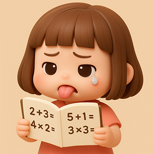

# Projet Thelma

Développons un programme pour aider une écolière de CE1 à réviser ses tables !

## Thèmes abordés

{ align=right }

+   variables, 
+   conditions, 
+   boucles, 
+   I/O, 
+   fichiers, 
+   aléatoire, 
+   fonctions, 
+   chrono

## Avancement

Programme par défaut en C :

```c
#include <stdio.h>              // La bibliothèque qui permet d'utiliser printf.

int main() {                    // La fonction principale, le point d'entrée du programme.
    printf("hello, world!");    // Affiche "hello, world!" dans la sortie standard.
    return 0;                   // R.A.S., on signale à l'OS que tout s'est bien passé.
}
```

1.  Afficher un calcul et son résultat

    1.  En “dur”

        ```c
        printf("1 + 1 = 2");  
        printf("1 + 1 = 42");  
        ```

    2. En calculant vraiment
    
        ```c
        printf("%d + %d = %d\n", 1, 1, 1 + 1);
        ```


2.  Afficher une table d'addition

    1.  Avec 10 printf

        ```c
        printf("%d + %d = %d\n", 1, 0, 1 + 0);
        printf("%d + %d = %d\n", 1, 1, 1 + 1);
        printf("%d + %d = %d\n", 1, 2, 1 + 2);
        printf("%d + %d = %d\n", 1, 3, 1 + 3);
        printf("%d + %d = %d\n", 1, 4, 1 + 4);
        printf("%d + %d = %d\n", 1, 5, 1 + 5);
        printf("%d + %d = %d\n", 1, 6, 1 + 6);
        printf("%d + %d = %d\n", 1, 7, 1 + 7);
        printf("%d + %d = %d\n", 1, 8, 1 + 8);
        printf("%d + %d = %d\n", 1, 9, 1 + 9);
        ```

    2.  Avec une boucle

        ```c
        // Avec une boucle while (tant que) qui répète les instructions qu'elle contient tant que la condition est vraie.
        int n2 = 0; // Utilisation d'une variable pour stocker la valeur à ajouter qui s'incrémente à chaque itération de la boucle.
        while (n2 < 10) {
            printf("1 + %d = %2d\n", n2, 1 + n2);
            n2 = n2 + 1; // On incrémente n2 sinon on a une boucle infinie.
        }

        // Avec une boucle for (pour)
        for (n2 = 0; n2 < 10; n2 = n2 + 1) {
            printf("1 + %d = %2d\n", n2, 1 + n2);
        }
        ```

    3.  En laissant le choix à l'utilisateur
    
        ```c
        int n1, n2 = 0;

        // Choix de la table
        do {
            printf("Quelle table [0-9] souhaitez-vous afficher ?\n");
            scanf("%d", &n1);
        } while (n1 < 0 || n1 > 9);

        while (n2 < 10) {
            printf("%d + %d = %2d\n", n1, n2, n1 + n2);
            n2 = n2 + 1;
        }
        ```

3.  Afficher toutes les tables

    1.  Pour un opérateur en "dur"

        ```c
        int n1 = 1, n2 = 0;

        // Boucles imbriquées
        // La première permet de passer de table en table
        while (n1 < 10) {
            printf("Table de %d\n----------\n", n1);
            
            // La seconde (déjà vue) affiche chaque table
            while (n2 < 10) {
                printf("%d + %d = %2d\n", n1, n2, n1 + n2);
                n2 = n2 + 1;
            }

            n1 = n1 + 1;
            n2 = 0;
            printf("\n");
        }
        ```

    2. Pour un opérateur au choix 

        ```c
        #include <stdio.h>

        int main () {

            int signe, n1, n2 = 0;

            // Choix du signe
            do {
                printf("De quelle opération affiche-t-on la table ?\n1. Addition\n2. Soustraction\n3. Multiplication\n> ");
                scanf("%d", &signe);
            } while (signe != 1 && signe != 2 && signe != 3);

            // Choix de la table
            do {
                printf("Quelle table [0-9] souhaitez-vous afficher ?\n");
                scanf("%d", &n1);
            } while (n1 < 0 || n1 > 9);

            while (n2 < 10) {
                // Addition
                if (signe == 1) {
                    printf("%d + %d = %2d\n", n1, n2, n1 + n2);
                }
                // Soustraction
                else if (signe == 2) {
                    printf("%d - %d = %2d\n", n1, n2, n1 - n2);
                    if (n1 - n2 == 0) {
                        break;
                    }
                }
                // Multiplication
                else if (signe == 3) {
                    printf("%d x %d = %2d\n", n1, n2, n1 * n2);
                }
                n2 = n2 + 1;
            }

            return 0;
        }
        ```
    
4.  Poser une question à l’utilisateur

    - [x] Générer des nombres aléatoirement : `srand()` et `rand()`

        ??? info "Exemple"

            ```c
            #include <stdio.h>
            #include <stdlib.h> // Bibliothèque contenant srand() et rand()
            #include <time.h>   // Bibliothèque contenant time()

            int main() {

                /* 
                1 - Initialisation du seed pour l'aléatoire
                On l'initialise avec time(NULL) qui renvoie l'heure du 
                système en seconde de manière à avoir une valeur différente 
                à chaque exécution.
                On ne le fait qu'une seule fois au début du programme.
                */

                srand(time(NULL));

                /*
                2 - Génération d'un nombre aléatoire
                On récupère le reste de la division du résultat de rand() 
                par 10 (modulo 10 ou % 10) pour récupérer un nombre entre 0 et 9.
                */

                int a = rand() % 10, b = rand() % 10;

                printf("%d + %d = ?\n", a, b);

                return 0;
            }
            ```

    - [x] Demander une saisie à l'utilisateur : `scanf()`

    - [x] Afficher des valeurs différentes à chaque calcul : `printf()` et variables

    - [x] Vérifie le résultat : `if` ou `while` 

    - [x] Poser 10 questions : `for`
    
    - [x] Demander à l'utilisateur d'appuyer sur une touche (n'importe laquelle...) : `getchar()`

    Exemple :
    ```output
    3 x 5 = ?
    > 10
    Oups ! La bonne réponse est 15.
    
    Appuie sur une touche pour continuer...
    ```

    ```output
    2 + 5 = ?
    > 7
    Bravo !
    
    Appuie sur une touche pour continuer...
    ```

    ```c
    #include <stdio.h>
    #include <stdlib.h>
    #include <time.h>

    int main() {

        // Initialiser le seed pour l'aléatoire
        srand(time(NULL));

        int a, b, input, result;
        
        for (int i = 1; i <= 10; i++) {

            // Afficher le calcul à effectuer
            b = rand() % 10;
            a = rand() % 10;
            result = a + b;

            system("cls");
            printf("Question %d :\n\n", i);

            printf("%d + %d = ?\n> ", a, b);

            // Gérer la réponse de l'utilisateur
            scanf("%d", &input);
            
            // Valider la réponse
            if (input == result) {
                printf("Bravo !");
            }
            else {
                printf("Oups ! La bonne réponse est %d.", result);
            }

            // Attendre...
            printf("\n\nAppuyer sur Entrée pour continuer...");
            getchar();
            getchar();
        }

        return 0;
    }
    ```
    
5.  Poser une suite de questions à l’utilisateur

    1. Compter les points (réponses fausses acceptées)

    ```c
    
    ```
    
    2. Ne pas passer à la suivante tant que la réponse est fausse

    ```c
    
    ```
    
6. Créer un quiz aléatoire sur une table

    1. 2 x 4 = ?

    ```c
    
    ```
    
    2. 2 + ? = 5

    ```c
    
    ```
    
7. Créer un quiz aléatoire en laissant le choix à l’utilisateur des opérateurs et des tables

    ```c
    
    ```
    
8. Créer un quiz chronométré

    ```c
    
    ```
    
9. Créer un quiz minuté ?

    ```c
    
    ```
    
10. Créer un quiz qui donne les réponses juste après chaque question ou à la fin de toutes les questions 

    ```c
    
    ```
    
11. Créer un top
    1. En mémoire

    ```c
    
    ```
    
    2. Sauvegardé

    ```c
    
    ```
    
12. Créer un menu

    ```c
    
    ```
    
13. Tester
    
14. Livrer