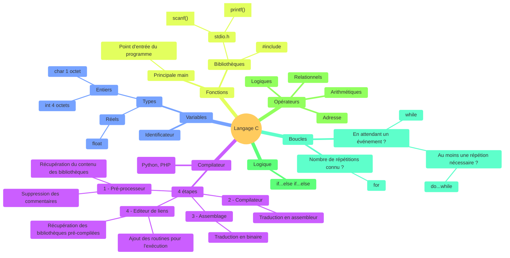
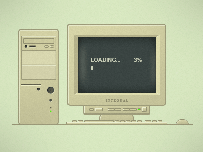

# 02 - Premiers programmes

## Récapitulatif



## Exercice 1

Créer un programme `exo1.c` qui demande à l'utilisateur son année de naissance et lui donne son âge.

```
> ./exo1.exe
Annee de naissance : 1984
Vous avez 38 ans !
```

> On sera plus précis dans l'exercice 3

??? success "Correction"

    

## Exercice 2

Créer un programme `exo2.c` qui demande à l'utilisateur sa date de naissance et lui souhaite un joyeux anniversaire **si** c'est aujourd'hui.

> Réfléchir sur le papier

> La date du jour doit être définie dans des **constantes**.

```
// Si nous sommes le 22/09 😄

> ./exo2.exe
Date de naissance : 22/09/1984
Joyeux anniversaire !

> ./exo2.exe
Date de naissance : 07/09/1984
Joyeux non-anniversaire !
```

??? success "Correction"

    

## Exercice 3

Créer un programme exo3.c qui demande à l'utilisateur son année, puis son mois, puis son jour de naissance et lui donne son âge plus précisément qu'à l'exercice 1.

```
> ./exo3.exe
Date de naissance : 25/09/1984
Vous avez 40 ans !

> ./exo3.exe
Date de naissance : 20/09/1984
Vous avez 41 ans !
```

??? success "Correction"

    


## Exercice sur papier 1

Soit le programme suivant :

```c
#include <stdio.h>

int main() {
    int a = 0, b = 1, c = 2, d = 3;
    
    a = 5;                  // a:      b:     c:     d:
    a + b;                  // a:      b:     c:     d:
    c = a + b;              // a:      b:     c:     d:
    d = a - (2 * d - b);    // a:      b:     c:     d: 
    c = a + b * -c + 1;     // a:      b:     c:     d:
    a = b = c;              // a:      b:     c:     d:
    
    return 0;
}
```

Définir sur papier les valeurs stockées dans les variables a, b, c et d à la fin de chaque instruction.

> Les priorité des calculs sont les mêmes qu'en mathématiques

??? success "Correction"

    

## Exercice sur papier 2

Le programme suivant ne fonctionne pas... Pourquoi ?

```c
#include <stio.h>

main() {
    int jour = 0, mois = 0 annee = 0;

    printf("Donner un jour (1-31) : );
    scanf("%d", &jour);
    
    printf("Donner un mois (1-12) : ");
    scanf("%d", mois);

    printf("Donner un année (0-2021) : ")
    scanf("%d", &annee);
    
    print("La date saisie est : %02d/%02d/%04d", jour, mois, annee);

    return 0;
}
```

??? success "Correction"

    

## Exercice 4

Créer un programme exo4.c qui demande un entier à l'utilisateur puis lui affiche la conversion en hexadécimal et en octal.

```
> ./exo4.exe
Nombre à convertir : 42
Hexadécimal : 2A
Octal : 52
```

??? info "Un indice ?"

    Format pour `printf` :

    +   Octal : `%o`

    +   Hexadécimal : `%X`

??? success "Correction"

    

## Exercice 5

Créer un programme exo5.c qui convertit des composantes RGB de décimal en hexadécimal.

```
> ./exo5.exe
Couleur en décimal : 255 204 0
Couleur en hexa    : #FFCC00
```

??? danger "Aller plus loin"
    
    Programmer l'inverse.
    
    ```
    > ./exo5.exe
    Couleur en hexa    : #FFCC00
    Couleur en décimal : 255 204 0
    ```

??? success "Correction"

    
