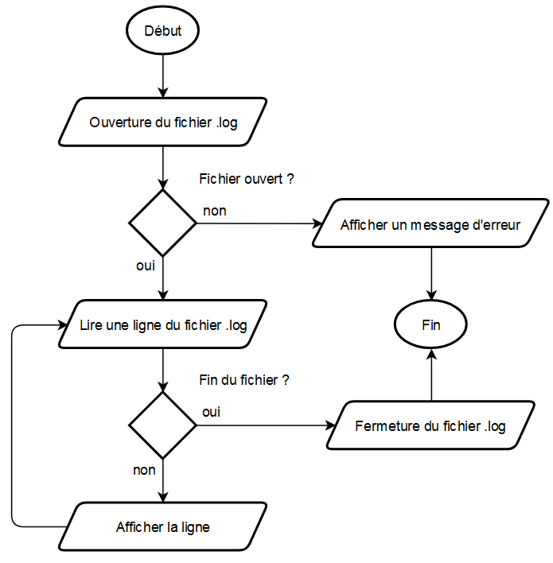

# Les experts - Laval


## Contexte

Mme H.GENNERO, résidant au 18 rue du Gué d'Orger à Laval, s'est présentée ce matin au poste de police où vous officez en tant que technicien de police scientifique. 

Elle aurait aperçu son ex-compagnon, M. H.GRUBER, à plusieurs reprises à proximité de son domicile entre le 1er et le 25 novembre 2024. Sous le coup d'une injonction d'éloignement de 500 m, celui-ci est équipé d'un bracelet anti-rapprochement. Toutefois vos collègues du pôle national de télésurveillance et assistance n'ont pas relevé d'alerte sur cette période. 

L'inspecteur J.MCLANE convoque M. H.GRUBER. Durant son interrogatoire, vous êtes mandaté pour analyser le **fichier de journalisation des géolocalisations** du bracelet de M. H.GRUBER. Ce fichier contient les traces NMEA régulièrement générées par le capteur GPS du bracelet entre le 1er et 25 novembre 2024.

[:material-file-download: Télécharger le fichier de journalisation](../files/bts1/gruber_20241126.log){ .md-button .md-button--primary }

## Votre mission

Créer un programme permettant d'analyser le fichier de journalisation fourni et de générer un fichier CSV (séparateur point-virgule (;)) contenant la liste des géolocalisations contrevenant à l'injonction d'éloignement de M. H. GRUBER.

Pour chaque géolocalisation, les informations suivantes devront être mentionnées :

+   Date (`jj/mm/aaaa`),
+   Heure (`hh:mm:ss`),
+   Les coordonnées GPS en degrés décimaux (`DD.DDDDDD`),
+   La distance à vol d'oiseau calculée en mètres (`m`).

## Analyse 🔍

Voici la liste des points à éclaircir avant de coder :

+ [X] Lire un fichier CSV en C 📄

    + [X] Lire un fichier texte ligne par ligne

    + [X] Séparer les données de chaque ligne suivant un séparateur (token)

+ [X] Décoder une trame NMEA 🛰️

    + [X] Vérifier le checksum
    
    + [X] Récupérer l'heure

    + [X] Récupérer et convertir la latitude et la longitude en degrés décimaux

+ [X] Calculer la date 📆

+ [X] Calculer une distance à vol d'oiseau à partir de coordonnées GPS 🕊️

    ??? question "Calculer la distance entre deux points du globe 🌍 à partir de leurs coordonnées GPS 🛰️"

        La distance d entre deux points A et B sera calculée en utilisant la formule suivante :

        \begin{split}
        &x=(longitudeB-longitudeA)\times\cos(\frac{latitudeA+latitudeB}{2}) \\
        &y=latitudeB-latitudeA \\
        &d=\sqrt{x^2+y^2}\times6371
        \end{split}

        Notes : 
        
        +   Dans cette formule, les latitudes et longitudes sont exprimées en **radians**. 
        
        +   6371 correspond au rayon de la terre en km.

+ [ ] Ecrire un fichier CSV en C ✏️

## Développement incrémental

### Lire un fichier ligne par ligne

Coder le programme suivant :



??? success "Code en C"

    ```c
    #include <stdio.h>

    int main() {
        
        char cheminFichierLog[] = "gruber_20241126.log",
            ligne[100];

        FILE * fichierLog = NULL;
        
        // Ouverture du fichier
        fichierLog = fopen(cheminFichierLog, "r");

        // Vérification
        if (fichierLog == NULL) {
            puts("Erreur lors de l'ouverture en lecture du fichier de log");
            return -1;
        }
        
        // Lecture ligne à ligne
        while (fgets(ligne, 100, fichierLog) != NULL) {
            printf(ligne);
        }

        // Fermeture du fichier
        fclose(fichierLog);

        return 0;
    }
    ```

:octicons-arrow-right-16: Transformer ce programme en fonction et la stocker dans une bibliothèque `experts.h`

??? success "Code en C"

    :octicons-file-16: `experts.h`

    ```c
    #include <stdio.h>
    #include <stdlib.h>

    void lireFichier(char *);

    void lireFichier(char * cheminFichier) {
        char ligne[100];

        FILE * fichier = NULL;
        
        fichier = fopen(cheminFichier, "r");
        if (fichier == NULL) {
            puts("Erreur lors de l'ouverture en lecture du fichier de log");
            exit(-1);
        }
        
        while (fgets(ligne, 100, fichier) != NULL) {
            printf(ligne);
        }
        
        fclose(fichier);
    }
    ```

    :octicons-file-16: `experts.c`

    ```c
    #include "experts.h"

    int main() {
        
        lireFichier("gruber_20241126.log");

        return 0;
    }
    ```

### Vérifier le checksum d'une trame NMEA

Créer un programme qui isole, calcule et vérifie le checksum de la trame NMEA suivante :

```
$GPGGA,080104.555,4804.656727,N,00047.507355,W,1,04,3.8,88.27,M,,,,,0000*3E
```

??? info "Indice 1"

    S'inspirer des exemples fournis sur cette [page](https://rietman.wordpress.com/2008/09/25/how-to-calculate-the-nmea-checksum/).

??? success "Code en C"

    ```c
    #include <stdio.h>

    int main() {

        char trame[] = "$GPGGA,080104.555,4804.656727,N,00047.507355,W,1,04,3.8,88.27,M,,,,,0000*3E";
        char checksumCalcule = 0, checksumLu;
        int i;
        
        // Calcul du checksum
        for (i = 1; trame[i] != '*'; i++) {
            checksumCalcule ^= trame[i];    
        }

        // Lecture du checksum
        sscanf(trame + i + 1, "%x", &checksumLu);

        // Comparaison
        if (checksumCalcule == checksumLu) {
            puts("OK !");
        }
        else {
            puts("KO...");
        }
        
        return 0;
    }
    ```

:octicons-arrow-right-16: Transformer ce programme en fonction, la stocker dans une bibliothèque `experts.h` et tester avec d'autres trames.

??? success "Code en C"

    :octicons-file-16: `experts.h`

    ```c
    #include <stdio.h>
    #include <stdlib.h>

    // [...]
    int verifierChecksumNMEA(char *);

    // [...]
    int verifierChecksumNMEA(char * trame) {
        char checksumCalcule = 0, checksumLu;
        int i;

        // Calcul du checksum
        for (i = 1; trame[i] != '*'; i++) {
            checksumCalcule ^= trame[i];
        }

        // Lecture du checksum
        sscanf(trame + i + 1, "%x", &checksumLu);

        // Comparaison
        return checksumCalcule == checksumLu;
    }
    ```

    :octicons-file-16: `experts.c`

    ```c
    #include "experts.h"

    int main() {

        if (verifierChecksumNMEA("$GPGGA,080104.555,4804.656727,N,00047.507355,W,1,04,3.8,88.27,M,,,,,0000*3E")) {
            puts("OK !");
        }
        else {
            puts("KO...");
        }
        
        return 0;
    }
    ```

### Séparer les données de chaque ligne suivant un séparateur (token)

Créer un programme qui lit la ligne suivante, extrait chacune des valeurs dans une chaine de caractères et les affiche.

```
$GPGGA,080104.555,4804.656727,N,00047.507355,W,1,04,3.8,88.27,M,,,,,0000*3E
```

??? info "Indice 1"

    Utiliser un tableau de chaînes de caractères

??? info "Indice 2"

    Utiliser la fonction [strtok()](https://koor.fr/C/cstring/strtok.wp)

??? success "Code en C"

    Solution avec un tableau de tableau qui récupère toutes les valeurs (quand on veut tout récupérer) :

    ```c
    #include <stdio.h>
    #include <string.h>

    int main() {

        char ligne[] = "$GPGGA,080104.555,4804.656727,N,00047.507355,W,1,04,3.8,88.27,M,,,,,0000*3E";
        char valeurs[12][13] = { "" };
        int i = 0;

        char * valeur = strtok (ligne, ",");
        while (valeur != NULL) {
            strcpy(valeurs[i++], valeur);
            valeur = strtok (NULL, ",");
        }

        for (int i = 0; i < 12; i++) {
            puts(valeurs[i]);
        }
        
        return 0;
    }
    ```

    Solution avec des variables différenciées (quand on ne veut récupérer que certaines valeurs)

    ```c
    #include <stdio.h>
    #include <string.h>

    int main() {

        char ligne[] = "$GPGGA,080104.555,4804.656727,N,00047.507355,W,1,04,3.8,88.27,M,,,,,0000*3E";
        char heure[11], latitude[12], longitude[13], ns[2], we[2];
        int i = 0;
        char * valeur = NULL;
        
        valeur = strtok(ligne, ",");
        for (int i = 1; valeur != NULL; i++) {
            switch(i) {
                case 2 : strcpy(heure, valeur);     break;
                case 3 : strcpy(latitude, valeur);  break;
                case 4 : strcpy(ns, valeur);        break;
                case 5 : strcpy(longitude, valeur); break;
                case 6 : strcpy(we, valeur);        break;
            }
            valeur = strtok(NULL, ",");
        }

        puts(heure);
        puts(latitude);
        puts(ns);
        puts(longitude);
        puts(we);
        
        return 0;
    }
    ```

:octicons-arrow-right-16: Transformer ce programme en fonction, la stocker dans une bibliothèque `experts.h` et tester avec d'autres trames.

??? success "Code en C"

    :octicons-file-16: `experts.h`

    ```c
    // [...]
    #include <string.h>

    // [...]
    void extraireValeurs(char *, char *, char *, char *, char *, char*);

    // [...]
    void extraireValeurs(char * ligne, char * heure, char * latitude, char * ns, char * longitude, char* we) {
        char * valeur = NULL;
        
        valeur = strtok(ligne, ",");
        for (int i = 1; valeur != NULL; i++) {
            switch(i) {
                case 2 : strcpy(heure, valeur);     break;
                case 3 : strcpy(latitude, valeur);  break;
                case 4 : strcpy(ns, valeur);        break;
                case 5 : strcpy(longitude, valeur); break;
                case 6 : strcpy(we, valeur);        break;
            }
            valeur = strtok(NULL, ",");
        }
    }
    ```

    :octicons-file-16: `experts.c`

    ```c
    #include "experts.h"

    int main() {

        char trame[] = "$GPGGA,080104.555,4804.656727,N,00047.507355,W,1,04,3.8,88.27,M,,,,,0000*3E";
        char heureTxt[11], latitudeTxt[12], longitudeTxt[13], ns[2], we[2];
        
        extraireValeurs(trame, heureTxt, latitudeTxt, ns, longitudeTxt, we);

        puts(heureTxt);
        puts(latitudeTxt);
        puts(ns);
        puts(longitudeTxt);
        puts(we);
        
        return 0;
    }
    ```


### Convertir les données lues

Créer une fonction pour chacune des conversions suivantes :

+   Passer d'une heure au format `hhmmss.sss` au format `hh:mm:ss`

    ??? success "Code en C"

        ```c
        void convertirHeure(char * nmea, char * resultat) {
            sprintf(resultat, "%c%c:%c%c:%c%c", nmea[0], nmea[1], nmea[2], nmea[3], nmea[4], nmea[5]);
        }
        ```

+   Passer d'une coordonnée au format DDDMM.MMMMMM + N/S ou E/W au format (-)DDD.DDDDDD

    ??? success "Code en C"

        ```c
        float convertirCoordonnees(char * coordonnee, char * direction) {
            char * point = NULL, degres[4] = "";
            float resultat;
            
            // Recupération des degrés
            point = strchr(coordonnee, '.');
            strncpy(degres, coordonnee, point - coordonnee - 2);
            resultat = atof(degres);
            
            // Extraction des minutes et conversion en degrés
            resultat += atof(point - 2) / 60;

            // Gestion de la direction
            if (*direction == 'S' || *direction == 'W') {
                resultat *= -1;
            }
            
            return resultat;
        }
        ```

### Calculer une distance à vol d'oiseau

Créer une fonction qui calcule la distance à vol d'oiseau entre deux points à partir de leurs coordonnées GPS (en degrés décimaux).

??? info "Indice"

    

    J'ai l'impression qu'on se répète...

??? success "Code en C"

    ```c
    // Bibliothèque pour obtenir PI, cos, pow et sqrt
    #define _USE_MATH_DEFINES
    #include <math.h>

    float convertirDegresEnRadians(float);
    float calculerDistance(float, float, float, float);

    int main() {

        printf("%f\n", calculerDistance(48.07429936102162, -0.7680080793209888, 48.07352056412836, -0.7723579441783978)); 
        
        // 334,87m d'après Google Maps
        
        return 0;
    }

    float convertirDegresEnRadians(float angle) {
        return angle * M_PI / 180;
    }

    float calculerDistance(float latA, float lngA, float latB, float lngB) {
        float distance = 0;

        // Conversion en radian
        latA = convertirDegresEnRadians(latA);
        lngA = convertirDegresEnRadians(lngA);
        latB = convertirDegresEnRadians(latB);
        lngB = convertirDegresEnRadians(lngB);

        // Calcul de la distance
        return sqrt(pow((lngB - lngA) * cos((latA + latB) / 2), 2) + pow(latB - latA, 2)) * 6371 * 1000;
    }
    ```

## Première intégration

A partir de la bibliothèque `experts.h` suivante, créer un programme qui lit le fichier `gruber_20241126.log` et affiche pour les trames valides dont la distance avec le domicile de Mme H.GENNERO est inférieure à 500 m :

+   Date (`jj/mm/aaaa`),
+   Heure (`hh:mm:ss`),
+   Les coordonnées GPS en degrés décimaux (`DD.DDDDDD`),
+   La distance à vol d'oiseau calculée en mètres (`m`).

[:material-file-download: Télécharger la bibliothèque experts.h](../files/bts1/experts.h){ .md-button .md-button--primary }

??? success "Première version"

    :octicons-file-16: `experts.h`

    On choisit de traiter le fichier ligne à ligne, tout le traitement va donc être réalisé dans la fonction `lireFichier`.

    ```c
    void lireFichier(char * cheminFichier) {
        char ligne[100], nmeaHeure[10], nmeaLatitude[12], nmeaNS[2], nmeaLongitude[13], nmeaWS[2], heure[9], date[] = "01/11/2024";
        float latitude, longitude, distance;
        int heureCourante, heurePrecedente = 0;

        FILE * fichier = NULL;
        
        fichier = fopen(cheminFichier, "r");
        if (fichier == NULL) {
            puts("Erreur lors de l'ouverture en lecture du fichier de log");
            exit(-1);
        }
        
        // Pour chaque ligne...
        while (fgets(ligne, 100, fichier) != NULL) {
            
            // ...on vérifie le checksum...
            if (verifierChecksumNMEA(ligne)) {
                
                // ...on extrait les valeurs...
                extraireValeurs(ligne, nmeaHeure, nmeaLatitude, nmeaNS, nmeaLongitude, nmeaWS);
                
                // ...convertit l'heure en texte...
                convertirHeure(nmeaHeure, heure);

                // ...puis en entier pour voir si on a changé de journée et gérer la date...
                heureCourante = extraireHeure(heure);
                if (heureCourante < heurePrecedente) {
                    incrementerDate(date);
                }
                heurePrecedente = heureCourante;

                // ...puis on convertit les coordonnées...
                latitude = convertirCoordonnees(nmeaLatitude, nmeaNS);
                longitude = convertirCoordonnees(nmeaLongitude, nmeaWS);

                // ...pour calculer la distance...
                distance = calculerDistance(48.06410268512942, -0.7801647985752476, latitude, longitude);

                // ...pour enfin vérifier si elle est inférieure à 500 m...
                if (distance < 500) {

                    // finalement on affiche les informations demandées
                    printf("%s %s (%f, %f) %f m\n", date, heure, latitude, longitude, distance);
                }
            }
        }
        
        fclose(fichier);
    }
    ```

    :octicons-file-16: `experts.c`

    La fonction principale se résume à un appel à la fonction `lireFichier`.

    ```c
    #include "experts.h"

    int main() {

        lireFichier("gruber_20241126.log");
        
        return 0;
    }
    ```

## Suite et fin

### Générer un fichier texte

Réaliser les exercices suivants :

+   Créer une fonction qui crée un fichier `exo1.txt` et le remplit en **une seule fois** avec une phrase passée en paramètre. 

    La tester avec la phrase :
    
        Le courage n'est pas l'absence de peur, mais la capacité de vaincre ce qui fait peur.

    ??? success "Solution"

        ```c
        #include <stdio.h>
        #include <stdlib.h>

        void exo1(char * chaine) {
            FILE * fichier = NULL;

            fichier = fopen("exo1.txt", "w");

            if (fichier == NULL) {
                puts("Exo 1 - Erreur lors de l'ouverture.");
                exit(-1);
            }

            fputs(chaine, fichier);

            fclose(fichier);
        }

        int main() {
            exo1("Le courage n'est pas l'absence de peur, mais la capacité de vaincre ce qui fait peur.");

            return 0;
        }
        ```

+   Créer une fonction qui crée un fichier `exo2.txt` et le remplit **5 caractères par 5 caractères** avec une phrase passée en paramètre.

    La tester avec la phrase :
    
        Quand on veut on peut, quand on peut on doit.

    ??? success "Solution"

        ```c
        #include <stdio.h>
        #include <stdlib.h>
        #include <string.h>

        void exo2(char * chaine) {
            FILE * fichier = NULL;
            int i = 0;

            fichier = fopen("exo2.txt", "w");

            if (fichier == NULL) {
                puts("Exo 2 - Erreur lors de l'ouverture.");
                exit(-1);
            }

            // Par soucis de généricité, pour ne pas dépasser la longueur 
            // de la chaîne pour les chaines dont la taille n'est pas un 
            // multiple de 5, on s'arrête 5 caractères avant la fin.
            for (i = 0; i < strlen(chaine) - 5; i += 5) {
                fwrite(chaine + i, sizeof(char), 5, fichier);
            }

            // On écrit finalement le reliquat (de 1 à 5 caractères)
            fwrite(chaine + i, sizeof(char), strlen(chaine) - i, fichier);

            fclose(fichier);
        }

        int main() {
            exo2("Quand on veut o123n peut, quand on peut on doit.");

            return 0;
        }
        ```

+   Créer une fonction qui crée un fichier `exo3.txt` et le remplit **caractère par caractère** avec une phrase passée en paramètre.

    La tester avec le texte :

        Entre :
        Ce que je pense,
        Ce que je veux dire, 
        Ce que je crois dire, 
        Ce que je dis, 
        Ce que vous avez envie d'entendre, 
        Ce que vous entendez, 
        Ce que vous comprenez... 
        Il y a dix possibilités qu'on ait des difficultés à communiquer. 
        Mais essayons quand même...

    ??? success "Solution"

        ```c
        #include <stdio.h>
        #include <stdlib.h>

        void exo3(char * chaine) {
            FILE * fichier = NULL;
            int i = 0;

            fichier = fopen("exo2.txt", "w");

            if (fichier == NULL) {
                puts("Exo 3 - Erreur lors de l'ouverture.");
                exit(-1);
            }

            // On parcourt la chaine caractère par caractère
            for (int i = 0; chaine[i] != '\0'; i++) {
                fputc(chaine[i], fichier);
            }

            fclose(fichier);
        }

        int main() {
            exo3("Entre :\nCe que je pense,\nCe que je veux dire,\nCe que je crois dire,\nCe que je dis,\nCe que vous avez envie d'entendre,\nCe que vous entendez,\nCe que vous comprenez..\nIl y a dix possibilités qu'on ait des difficultés à communiquer.\nMais essayons quand même...");

            return 0;
        }
        ```

+   Créer une fonction qui crée un fichier `exo4.csv` (séparateur : tabulation) et le remplit avec les valeurs de 3 tableaux passées en paramètres.

    La tester avec les tableaux suivants :

        [ 1, 2, 3, 4, 5, 6, 7, 8, 9, 10 ]

        [ 1.2, 3.4, 5.6, 6.7, 8.9, 0.1, 2.3, 4.5, 6.7, 8.9 ]

        [ Archibald, Tryphon, Piotr, Bianca, Tchang, Abdallah, Roberto, Séraphin, Allan, Oliveira ]

    ??? success "Solution"

        ```c
        #include <stdio.h>
        #include <stdlib.h>
        #include <string.h>

        // Les tableaux multidimensionnels dont la mémoire a été réservée dans la pile doivent être passés avec l'écriture tableau
        void exo4(int * a1, float * a2, char a3[10][10], int n) {
            FILE * fichier = NULL;

            fichier = fopen("exo4.csv", "w");

            if (fichier == NULL) {
                puts("Exo 4 - Erreur lors de l'ouverture.");
                exit(-1);
            }

            for (int i = 0; i < n; i++) {
                fprintf(fichier, "%d\t%f\t%s\n", a1[i], a2[i], a3[i]);
            }

            fclose(fichier);
        }

        int main() {

            int   tab1[10] = { 1, 2, 3, 4, 5, 6, 7, 8, 9, 10 };
            float tab2[10] = { 1.2, 3.4, 5.6, 6.7, 8.9, 0.1, 2.3, 4.5, 6.7, 8.9 };
            char  tab3[10][10] = { "Archibald", "Tryphon", "Piotr", "Bianca", "Tchang", "Abdallah", "Roberto", "Séraphin", "Allan", "Oliveira" };
            
            exo4(tab1, tab2, tab3, 10);

            return 0;
        }
        ```

### Rendre le programme générique

<object class="fullScreenAble" data="../../pdf/cours/bts1/bts1_10_argc-argv.pdf" type="application/pdf"></object>

Créer un programme qui prend 4 paramètres d'entrées : 

+   le chemin d'un fichier

+   une date au format jj/mm/aaaa

+   la latitude et la longitude en degrés décimaux d'une coordonnée GPS

Le programme vérifie la présence des paramètres, convertit les coordonnées et affiche les paramètres à l'écran.

Exemple :

```
> param.exe ../eyjafjallajokull.txt 20/03/2010 63.63528391052931 -19.606861438578065
../eyjafjallajokull.txt
20/03/2010 
63.63528391052931 
-19.606861438578065
```

## Intégration finale

A partir des derniers travaux, reprendre la première intégration et terminer le programme avec les fonctionnalités suivantes :

+   exportation des résultats dans un fichier csv

+   programme générique pouvant prendre n'importe quel fichier de log, date de démarrage et coordonnées de domicile en entrée.

Tester.

## Programme final

??? success "Solution"

    