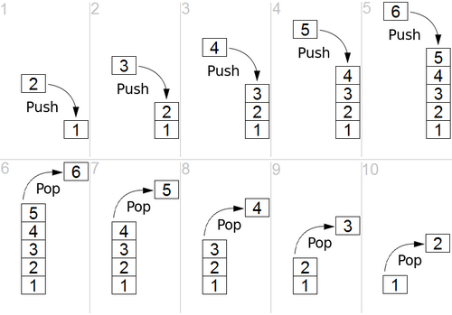
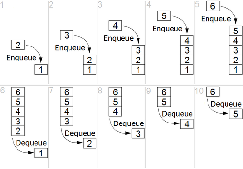

# Listes chaînées


## Exercice 1

Créer dans l'ordre les fonctions suivantes :

1. Première étape

    + `nodeCreate` pour créer un noeud en lui affectant une valeur.

    + `nodeDisplay` pour afficher un noeud.

    + `nodesFree` pour libérer une liste chaînée.

2. Deuxième étape

    + `nodePush` pour ajouter un noeud à la fin d'une liste chaînée.

    + `nodesCount` pour compter le nombre de noeuds d'une liste chaînée.

    + `nodeAt` pour récupérer le noeud d'indice n dans une liste chaînée.

3. Troisième étape

    + `nodeDelete` pour supprimer le noeud d'indice n dans une liste chaînée.

    + `nodesDisplay` pour afficher les valeurs d'une liste chaînée.

4. Quatrième étape

    + `nodeShift` pour ajouter un noeud à la première place d'une liste chaînée.

    + `nodeInsert` pour insérer un noeud à l'indice n d'une liste chaînée (mais pas la première 😅).

afin que le programme suivant :

```c
#include <stdio.h>
#include <stdlib.h>

typedef struct Node {
    int value;
    struct Node * next;
} Node;

int main() {
    Node * n1 = nodeCreate(8);
    nodeDisplay(n1);

    nodePush(n1, 15);
    nodePush(n1, 22);
    nodePush(n1, 23);
    nodePush(n1, 42);

    printf("\nTaille : %d\n", nodesCount(n1));

    nodeDisplay(nodeAt(n1, 1));
    nodeDisplay(nodeAt(n1, 5));

    n1 = nodeDelete(n1, 2);
    nodesDisplay(n1);

    n1 = nodeShift(n1, 4);
    nodesDisplay(n1);

    nodeInsert(n1, 3, 16);
    nodesDisplay(n1);

    nodesFree(n1);

    return 0;
}

```

affiche le résultat suivant :

```
> ./a.exe
8

Taille : 5
15
NULL

Taille : 4
 0: 8
 1: 15
 2: 23
 3: 42

Taille : 5
 0: 4
 1: 8
 2: 15
 3: 23
 4: 42

Taille : 6
 0: 4
 1: 8
 2: 15
 3: 16
 4: 23
 5: 42

```

??? success "Solution"

    ```c
    #include <stdio.h>
    #include <stdlib.h>

    typedef struct Node {
        int value;
        struct Node * next;
    } Node;

    // 1ère étape
    Node * nodeCreate(int);
    void nodeDisplay(Node *);
    void nodesFree(Node *);

    // 2ème étape
    void nodePush(Node *, int);
    int nodesCount(Node *);
    Node * nodeAt(Node *, int);

    // 3ème étape
    Node * nodeDelete(Node *, int);
    void nodesDisplay(Node *);

    // 4ème étape
    Node * nodeShift(Node *, int);
    void nodeInsert(Node *, int, int);

    // [8|•]->[15|•]->[22|•]->[23|•]->[42|NULL]

    int main() {
        Node * n1 = nodeCreate(8);
        nodeDisplay(n1);

        nodePush(n1, 15);
        nodePush(n1, 22);
        nodePush(n1, 23);
        nodePush(n1, 42);

        printf("\nTaille : %d\n", nodesCount(n1));
        
        nodeDisplay(nodeAt(n1, 1));
        nodeDisplay(nodeAt(n1, 5));

        
        n1 = nodeDelete(n1, 2);
        nodesDisplay(n1);

        n1 = nodeShift(n1, 4);
        nodesDisplay(n1);

        nodeInsert(n1, 3, 16);
        nodesDisplay(n1);
        
        nodesFree(n1);

        return 0;
    }

    Node * nodeCreate(int value) {
        Node * newNode = (Node *) malloc(sizeof(Node));
        if (newNode == NULL) {
            puts("Erreur d'allocation !");
            exit(-1);
        }
        newNode->value = value;
        newNode->next = NULL;
        return newNode;
    }

    void nodeDisplay(Node * n) {
        if (n != NULL) {
            printf("%d\n", n->value);
        }
        else {
            printf("NULL\n");
        }
    }

    void nodesFree(Node * n) {
        Node * temp;
        while (n != NULL) {
            temp = n->next;
            free(n);
            n = temp;
        }
    }

    void nodePush(Node * n, int value) {
        Node * newNode = nodeCreate(value);
        while (n->next != NULL) {
            n = n->next;
        }
        n->next = newNode;
    }

    int nodesCount(Node *n) {
        int count = 0;
        while (n != NULL) {
            count++;
            n = n->next;
        }
        return count;
    }

    Node * nodeAt(Node * n, int i) {
        for (int j = 0; j < i; j++) {
            n = n->next;
        }
        return i < 0 ? NULL : n;
    }

    Node * nodeDelete(Node * n, int i) {
        Node * temp, * next;

        if (i == 0 && n != NULL) {
            temp = n->next;
            free(n);
            return temp;
        }
        
        temp = nodeAt(n, i - 1);
        if (temp != NULL && temp->next != NULL) {
            next = temp->next;
            temp->next = next->next;
            free(next);
        }
        return n;
    }

    void nodesDisplay(Node *n) {
        printf("\nTaille : %d\n", nodesCount(n));
        for (int i = 0; n != NULL; i++, n = n->next) {
            printf("%2d: %2d\n", i, n->value);
        }
    }

    Node * nodeShift(Node * n, int value) {
        Node * newNode = nodeCreate(value);
        newNode->next = n;
        return newNode;
    }

    void nodeInsert(Node * n, int i, int value) {
        Node * prev = nodeAt(n, i - 1), * newNode = NULL;
        if (i != 0 && prev != NULL) {
            newNode = nodeCreate(value);
            newNode->next = prev->next;
            prev->next = newNode;
        }
    }
    ```

## Pile et File

### Qu’est-ce qu’une pile ou une file en informatique ?

Une pile ou une file en informatique est un espace de stockage alloué en mémoire pour y stocker temporairement des données en attente de traitement.

La taille de stockage maximale est généralement définie à l’avance.

On peut donc remplir la pile ou la file en entrée par des données à traiter ultérieurement, et on peut vider la pile ou la file en sortie au fur et à mesure que les traitements sur ces données sont effectués.

Une pile ou une file peut donc à un moment donné être pleine ou être vide (ou ni l’un ni l’autre bien sûr).

### Quelle est la différence entre une pile et une file ?

Une pile est une structure dite LIFO en anglais « last in, first out » soit « dernier entré, premier sorti ».

D’une manière imagée, on peut faire l’analogie avec une pile d’assiettes.



Une file est une structure dite FIFO en anglais « first in, first out » soit « premier entré, premier sorti ».

D’une manière imagée, on peut faire l’analogie avec une file d’attente (sous forme de queue devant un guichet par exemple).



## Exercice 2 - Pile

De manière à ce que le programme gérant une **pile** ci-après affiche :

```
> ./pile.exe
Pile (1/7) :   1 → [     ][     ][     ][     ][     ][     ][   1 ]
Pile (2/7) :   2 → [     ][     ][     ][     ][     ][   2 ][   1 ]
Pile (3/7) :   3 → [     ][     ][     ][     ][   3 ][   2 ][   1 ]
Pile (4/7) :   4 → [     ][     ][     ][   4 ][   3 ][   2 ][   1 ]
Pile (5/7) :   5 → [     ][     ][   5 ][   4 ][   3 ][   2 ][   1 ]
Pile (6/7) :   6 → [     ][   6 ][   5 ][   4 ][   3 ][   2 ][   1 ]
Pile (7/7) :   7 → [   7 ][   6 ][   5 ][   4 ][   3 ][   2 ][   1 ]
Pile (6/7) :   7 ← [     ][   6 ][   5 ][   4 ][   3 ][   2 ][   1 ]
Pile (5/7) :   6 ← [     ][     ][   5 ][   4 ][   3 ][   2 ][   1 ]
Pile (4/7) :   5 ← [     ][     ][     ][   4 ][   3 ][   2 ][   1 ]
Pile (3/7) :   4 ← [     ][     ][     ][     ][   3 ][   2 ][   1 ]
Pile (4/7) :  42 → [     ][     ][     ][  42 ][   3 ][   2 ][   1 ]
Pile (5/7) :  13 → [     ][     ][  13 ][  42 ][   3 ][   2 ][   1 ]
Pile (4/7) :  13 ← [     ][     ][     ][  42 ][   3 ][   2 ][   1 ]
Pile (3/7) :  42 ← [     ][     ][     ][     ][   3 ][   2 ][   1 ]
Pile (2/7) :   3 ← [     ][     ][     ][     ][     ][   2 ][   1 ]
Pile (1/7) :   2 ← [     ][     ][     ][     ][     ][     ][   1 ]
Pile (0/7) :   1 ← [     ][     ][     ][     ][     ][     ][     ]
Pile (1/7) : 123 → [     ][     ][     ][     ][     ][     ][ 123 ]
Pile (2/7) :  45 → [     ][     ][     ][     ][     ][  45 ][ 123 ]
```

Compléter les fonctions suivantes :

+ `stackCreate`

+ `stackIsEmpty`

+ `stackIsFull`

+ `stackPush`

+ `stackPop`

```c
#include <stdio.h>
#include <stdlib.h>
#include <stdbool.h>

typedef struct Element {
    int value;
    struct Element * next;
} Element;

typedef struct Stack {
    int length;
    int maxLength;
    struct Element * first;
} Stack;

Stack * stackCreate(int);
bool stackIsEmpty(Stack *);
bool stackIsFull(Stack *);
bool stackPush(Stack *, int);
bool stackPop(Stack *, int *);
void stackDisplayInput(Stack *, int);
void stackDisplayOutput(Stack *, int);

int main() {
    Stack * s = stackCreate(7);
    int value;
    
    system("chcp 65001");
    system("cls");

    for (int i = 1; !stackIsFull(s); i++) {
        stackPush(s, i);
        stackDisplayInput(s, i);
    }


    for (int i = 1; i < 5; i++) {
        stackPop(s, &value);
        stackDisplayOutput(s, value);
    }

    stackPush(s, 42);
    stackDisplayInput(s, 42);
    stackPush(s, 13);
    stackDisplayInput(s, 13);

    while (!stackIsEmpty(s)) {
        stackPop(s, &value);
        stackDisplayOutput(s, value);
    }

    stackPush(s, 123);
    stackDisplayInput(s, 123);
    stackPush(s, 45);
    stackDisplayInput(s, 45);

    return 0;
}

/**
 * @brief Crée une nouvelle pile dans le tas.
 * 
 * @param maxLength Le nombre maximal d'éléments dans la pile.
 * @return Stack* - La pile créée.
 */
Stack * stackCreate(int maxLength) {
    
    return NULL;
}

/**
 * @brief Permet de savoir si la pile est vide.
 * 
 * @param s (Stack *) La pile à étudier.
 * @return true - La pile est vide.
 * @return false - La pile n'est pas vide !
 */
bool stackIsEmpty(Stack * s) {
        
    return false;
}

/**
 * @brief Permet de savoir si la pile est... pleine !
 * 
 * @param s (Stack *) La pile à étudier.
 * @return true - La pile est pleine.
 * @return false - La pile n'est pas pleine !
 */
bool stackIsFull(Stack * s) {
        
    return false;
}

/**
 * @brief Empile un nouvel élément dans la pile.
 * 
 * @param s (Stack *) La pile sur laquelle on travaille.
 * @param value (int) La valeur de l'élément à empiler.
 * @return true - L'empilement a réussi.
 * @return false - Il n'y a plus de place !!!
 */
bool stackPush(Stack * s, int value) {
    
    return false;
}

/**
 * @brief Dépile un élément de la pile.
 * 
 * @param s (Stack *) La pile sur laquelle on travaille.
 * @param value (int *, sortie) La valeur de l'élément dépilé
 * @return true - Le dépilement s'est bien déroulé.
 * @return false - La pile était vide... 
 */
bool stackPop(Stack * s, int * value) {
    
    return false;
}

/**
 * @brief Affiche la pile suite à un empilement.
 * 
 * @param s (Stack *) La pile à afficher.
 * @param input (int) La valeur de l'élément empilé.
 */
void stackDisplayInput(Stack * s, int input) {
    printf("Pile (%d/%d) : %3d → ", s->length, s->maxLength, input);
    for (int i = 0; i < s->maxLength - s->length; i++) {
        printf("[     ]");
    }
    for (Element * e = s->first; e != NULL; e = e->next) {
        printf("[ %3d ]", e->value);
    }
    printf("\n");
}


/**
 * @brief Affiche la pile suite à un dépilement.
 * 
 * @param s (Stack *) La pile à afficher.
 * @param output (int) La valeur de l'élément dépilé.
 */
void stackDisplayOutput(Stack * s, int output) {
    printf("Pile (%d/%d) : %3d ← ", s->length, s->maxLength, output);
    for (int i = 0; i < s->maxLength - s->length; i++) {
        printf("[     ]");
    }
    for (Element * e = s->first; e != NULL; e = e->next) {
        printf("[ %3d ]", e->value);
    }
    printf("\n");
}
```

??? success "Solution"

    ```c
    #include <stdio.h>
    #include <stdlib.h>
    #include <stdbool.h>

    typedef struct Element {
        int value;
        struct Element * next;
    } Element;

    typedef struct Stack {
        int length;
        int maxLength;
        struct Element * first;
    } Stack;

    Stack * stackCreate(int);
    bool stackIsEmpty(Stack *);
    bool stackIsFull(Stack *);
    bool stackPush(Stack *, int);
    bool stackPop(Stack *, int *);
    void stackDisplayInput(Stack *, int);
    void stackDisplayOutput(Stack *, int);

    int main() {
        Stack * s = stackCreate(7);
        int value;

        system("chcp 65001");
        system("cls");

        for (int i = 1; !stackIsFull(s); i++) {
            stackPush(s, i);
            stackDisplayInput(s, i);
        }

        for (int i = 1; i < 5; i++) {
            stackPop(s, &value);
            stackDisplayOutput(s, value);
        }

        stackPush(s, 42);
        stackDisplayInput(s, 42);
        stackPush(s, 13);
        stackDisplayInput(s, 13);

        while (!stackIsEmpty(s)) {
            stackPop(s, &value);
            stackDisplayOutput(s, value);
        }

        stackPush(s, 123);
        stackDisplayInput(s, 123);
        stackPush(s, 45);
        stackDisplayInput(s, 45);

        return 0;
    }

    /**
    * @brief Crée une nouvelle pile dans le tas.
    * 
    * @param maxLength Le nombre maximal d'éléments dans la pile.
    * @return Stack* - La pile créée.
    */
    Stack * stackCreate(int maxLength) {
        Stack * newStack = (Stack *) malloc(sizeof(Stack));
        if (newStack == NULL) {
            puts("Erreur d'allocation - Stack");
            exit(-1);
        }
        newStack->length = 0;
        newStack->maxLength = maxLength;
        newStack->first = NULL;
        return newStack;
    }

    /**
    * @brief Permet de savoir si la pile est vide.
    * 
    * @param s (Stack *) La pile à étudier.
    * @return true - La pile est vide.
    * @return false - La pile n'est pas vide !
    */
    bool stackIsEmpty(Stack * s) {
        return s->length == 0;
    }

    /**
    * @brief Permet de savoir si la pile est... pleine !
    * 
    * @param s (Stack *) La pile à étudier.
    * @return true - La pile est pleine.
    * @return false - La pile n'est pas pleine !
    */
    bool stackIsFull(Stack * s) {
        return s->length == s->maxLength;
    }

    /**
    * @brief Empile un nouvel élément dans la pile.
    * 
    * @param s (Stack *) La pile sur laquelle on travaille.
    * @param value (int) La valeur de l'élément à empiler.
    * @return true - L'empilement a réussi.
    * @return false - Il n'y a plus de place !!!
    */
    bool stackPush(Stack * s, int value) {
        if (!stackIsFull(s)) {
            Element * newElement = (Element *) malloc(sizeof(Element));
            if (newElement == NULL) {
                puts("Erreur d'allocation - Element");
                exit(-2);
            }
            newElement->value = value;
            newElement->next = s->first;
            s->first = newElement;
            s->length++;
            return true;
        }
        return false;
    }

    /**
    * @brief Dépile un élément de la pile.
    * 
    * @param s (Stack *) La pile sur laquelle on travaille.
    * @param value (int *, sortie) La valeur de l'élément dépilé
    * @return true - Le dépilement s'est bien déroulé.
    * @return false - La pile était vide... 
    */
    bool stackPop(Stack * s, int * value) {
        Element * temp;
        if (!stackIsEmpty(s)) {
            *value = s->first->value;
            temp = s->first;
            s->first = s->first->next;
            free(temp);
            s->length--;
            return true;
        }
        return false;
    }

    /**
    * @brief Affiche la pile suite à un empilement.
    * 
    * @param s (Stack *) La pile à afficher.
    * @param input (int) La valeur de l'élément empilé.
    */
    void stackDisplayInput(Stack * s, int input) {
        printf("Pile (%d/%d) : %3d → ", s->length, s->maxLength, input);
        for (int i = 0; i < s->maxLength - s->length; i++) {
            printf("[     ]");
        }
        for (Element * e = s->first; e != NULL; e = e->next) {
            printf("[ %3d ]", e->value);
        }
        printf("\n");
    }


    /**
    * @brief Affiche la pile suite à un dépilement.
    * 
    * @param s (Stack *) La pile à afficher.
    * @param output (int) La valeur de l'élément dépilé.
    */
    void stackDisplayOutput(Stack * s, int output) {
        printf("Pile (%d/%d) : %3d ← ", s->length, s->maxLength, output);
        for (int i = 0; i < s->maxLength - s->length; i++) {
            printf("[     ]");
        }
        for (Element * e = s->first; e != NULL; e = e->next) {
            printf("[ %3d ]", e->value);
        }
        printf("\n");
    }
    ```

## Exercice 3 - File

De manière à ce que le programme gérant une **file** ci-après affiche :

```
> ./file.exe
File (1/7) :   1 → [     ][     ][     ][     ][     ][     ][   1 ]
File (2/7) :   2 → [     ][     ][     ][     ][     ][   2 ][   1 ]
File (3/7) :   3 → [     ][     ][     ][     ][   3 ][   2 ][   1 ]
File (4/7) :   4 → [     ][     ][     ][   4 ][   3 ][   2 ][   1 ]
File (5/7) :   5 → [     ][     ][   5 ][   4 ][   3 ][   2 ][   1 ]
File (6/7) :   6 → [     ][   6 ][   5 ][   4 ][   3 ][   2 ][   1 ]
File (7/7) :   7 → [   7 ][   6 ][   5 ][   4 ][   3 ][   2 ][   1 ]
File (6/7) :       [     ][   7 ][   6 ][   5 ][   4 ][   3 ][   2 ] → 1
File (5/7) :       [     ][     ][   7 ][   6 ][   5 ][   4 ][   3 ] → 2
File (4/7) :       [     ][     ][     ][   7 ][   6 ][   5 ][   4 ] → 3
File (3/7) :       [     ][     ][     ][     ][   7 ][   6 ][   5 ] → 4
File (4/7) :  42 → [     ][     ][     ][  42 ][   7 ][   6 ][   5 ]
File (5/7) :  13 → [     ][     ][  13 ][  42 ][   7 ][   6 ][   5 ]
File (4/7) :       [     ][     ][     ][  13 ][  42 ][   7 ][   6 ] → 5
File (3/7) :       [     ][     ][     ][     ][  13 ][  42 ][   7 ] → 6
File (2/7) :       [     ][     ][     ][     ][     ][  13 ][  42 ] → 7
File (1/7) :       [     ][     ][     ][     ][     ][     ][  13 ] → 42
File (0/7) :       [     ][     ][     ][     ][     ][     ][     ] → 13
File (1/7) : 123 → [     ][     ][     ][     ][     ][     ][ 123 ]
File (2/7) :  45 → [     ][     ][     ][     ][     ][  45 ][ 123 ]
```

Compléter les fonctions suivantes :

+ `queueCreate`

+ `queueIsEmpty`

+ `queueIsFull`

+ `queueEnqueue`

+ `queueDequeue`

```c
#include <stdio.h>
#include <stdlib.h>
#include <stdbool.h>

typedef struct Element {
    int value;
    struct Element * next;
    struct Element * prev;
} Element;

typedef struct Queue {
    int length;
    int maxLength;
    struct Element * first;
    struct Element * last;
} Queue;

Queue * queueCreate(int);
bool queueIsEmpty(Queue *);
bool queueIsFull(Queue *);
bool queueEnqueue(Queue *, int);
bool queueDequeue(Queue *, int *);
void queueDisplayInput(Queue *, int);
void queueDisplayOutput(Queue *, int);

int main() {
    Queue * s = queueCreate(7);
    int value;
    
    system("chcp 65001");
    system("cls");

    for (int i = 1; !queueIsFull(s); i++) {
        queueEnqueue(s, i);
        queueDisplayInput(s, i);
    }

    for (int i = 1; i < 5; i++) {
        queueDequeue(s, &value);
        queueDisplayOutput(s, value);
    }

    queueEnqueue(s, 42);
    queueDisplayInput(s, 42);
    queueEnqueue(s, 13);
    queueDisplayInput(s, 13);

    while (!queueIsEmpty(s)) {
        queueDequeue(s, &value);
        queueDisplayOutput(s, value);
    }

    queueEnqueue(s, 123);
    queueDisplayInput(s, 123);
    queueEnqueue(s, 45);
    queueDisplayInput(s, 45);

    return 0;
}

/**
 * @brief Crée une nouvelle file dans le tas.
 * 
 * @param maxLength Le nombre maximal d'éléments dans la file.
 * @return Stack* - La file créée.
 */
Queue * queueCreate(int maxLength) {

    return NULL;
}

/**
 * @brief Permet de savoir si la file est vide.
 * 
 * @param s (Stack *) La file à étudier.
 * @return true - La file est vide.
 * @return false - La file n'est pas vide ! (OO')
 */
bool queueIsEmpty(Queue * s) {

    return false;
}

/**
 * @brief Permet de savoir si la file est... pleine !
 * 
 * @param s (Stack *) La file à étudier.
 * @return true - La file est pleine.
 * @return false - La file n'est pas pleine ! Mais non ?!! Mais si !
 */
bool queueIsFull(Queue * s) {
    
    return false;
}

/**
 * @brief Enfile un nouvel élément dans la file.
 * 
 * @param s (Queue *) La file sur laquelle on travaille.
 * @param value (int) La valeur de l'élément à enfiler.
 * @return true - L'enfilement a réussi.
 * @return false - Il n'y a plus de place !!!
 */
bool queueEnqueue(Queue * s, int value) {
    
    return false;
}

/**
 * @brief Défile un élément de la file.
 * 
 * @param s (Queue *) La file sur laquelle on travaille.
 * @param value (int *, sortie) La valeur de l'élément défilé
 * @return true - Le défilement s'est bien déroulé.
 * @return false - La file était vide... 
 */
bool queueDequeue(Queue * s, int * value) {
    
    return false;
}

/**
 * @brief Affiche la file suite à un enfilement.
 * 
 * @param s (Queue *) La file à afficher.
 * @param input (int) La valeur de l'élément enfilé.
 */
void queueDisplayInput(Queue * s, int input) {
    printf("File (%d/%d) : %3d → ", s->length, s->maxLength, input);
    for (int i = 0; i < s->maxLength - s->length; i++) {
        printf("[     ]");
    }
    for (Element * e = s->first; e != NULL; e = e->next) {
        printf("[ %3d ]", e->value);
    }
    printf("\n");
}

/**
 * @brief Affiche la file suite à un défilement.
 * 
 * @param s (Queue *) La file à afficher.
 * @param output (int) La valeur de l'élément défilé.
 */
void queueDisplayOutput(Queue * s, int output) {
    printf("File (%d/%d) :       ", s->length, s->maxLength);
    for (int i = 0; i < s->maxLength - s->length; i++) {
        printf("[     ]");
    }
    for (Element * e = s->first; e != NULL; e = e->next) {
        printf("[ %3d ]", e->value);
    }
    printf(" → %d\n", output);
}
```