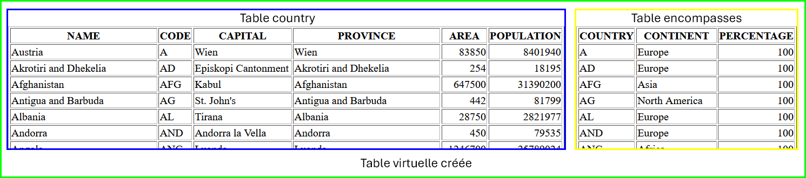

# 02 - Bases de données

## Un peu d'entraînement

Pour cet entraînement, nous utiliserons la base de données **MONDIAL**. 

Il s'agit d'une base de données rélationnelle qui compile un certain nombre de données géographiques et qui est gérée par l'université de Göttingen (dernière mise à jour en 2015).

Il est possible d'interagir avec elle en utilisant un formulaire que l'on trouve à l'adresse : [http://www.semwebtech.org/sqlfrontend/](http://www.semwebtech.org/sqlfrontend/)

1.  Afficher la liste des tables de cette BDR.

    Saisir la requête : 
    
    ```sql
    SELECT table_name FROM user_tables
    ```
    
    puis cliquer sur **send**.

    Vous devez obtenir la liste des 47 noms des tables présentes dans cette base de données.

2.  Description de la table `COUNTRY`.

    !!! abstract "Envoyer la requête suivante puis interpréter le résultat."
    
    ```sql
    DESC COUNTRY
    ```

    L'attribut `NULLABLE` affiché (`Yes` ou `No`) permet de définir si, lors de l'insertion, l'information est obligatoire ou pas.

3.  Exploration d'une table.

    !!! abstract "Avant d'envoyer les requêtes suivantes, les **interpréter** (= les traduire en français)"
    
    ```sql
    SELECT name FROM country

    SELECT name , capital FROM country

    SELECT name , capital FROM country ORDER BY name
     
    SELECT * FROM country
    ```

4.  On peut ajouter des **filtres** pour affiner les critères de sélection à l'aide d'une clause `WHERE` et combiner ces filtres à l'aide des opérateurs logiques `AND` et `OR`. 

    Exemple : 

    ```sql
    /* Afficher la liste des pays ayant plus de 60 millions d'habitants */
    SELECT name, population FROM country WHERE population > 60000000

    /* Afficher la liste des pays ayant plus de 60 millions d'habitants ET dont le nom commence par un E */
    SELECT name, population FROM country WHERE population > 60000000 AND name LIKE 'E%'
    ```

    Liste d'opérateurs de comparaisons utilisables :

    +   `=`  (égal)
    +   `<>` (différent de)
    +   `>` (supérieur)   `<` (inférieur)  `>=` (supérieur ou égal)    `<=` (inférieur ou égal)
    +   `IS NULL` (n'a pas de valeur)	`IS NOT NULL`
    +   `LIKE '%'` (comparaison avec un modèle)
    +   `IN (a, b...)` (dans une liste)

    !!! abstract "Afficher la liste des pays ayant moins de 10 habitants au km²."

    !!! abstract "Afficher la liste des villes de la zone tropicale ayant plus de 1 million d'habitants."

5.  On peut **trier** les résultats à l'aide du mot-clés `ORDER BY`.

    ```sql
    /* Afficher les pays par ordre alphabétique */
    SELECT name FROM country ORDER BY name
    ```

    `ORDER BY` doit toujours être en fin de requête.

    !!! abstract "Afficher la liste des pays par ordre décroissant de population."

    !!! abstract "Afficher la liste des villes française du nord au sud."

6.  Un certains nombres de fonctions permettent d'effectuer des transformations sur les valeurs de chaque ligne.

    En voici une liste non-exhaustive :

    | Fonctions                     | Description |
    | ----------------------------- | --- |
    | `UPPER(string)`               | Renvoie la chaîne de caractères en paramètre en majuscules |
    | `ROUND(reel [,precision])`    | Renvoie le réel en paramètre arrondi à la précision demandée sinon à l'entier |
    | `NOW()`                       | Renvoie la date et l'heure du système |
    | `TIMEDIFF(date1, date2)`      | Renvoie le nombre d'heure entre les deux dates |
    | `COALESCE(valeur, valeur...)` | Renvoie la première valeur non nulle |

    ```sql
    /* Afficher la liste des religions en France et la part de la population qui s'en revendique arrondie à l'entier */
    SELECT name, round(percentage) as pourcentage FROM religion WHERE country = 'F'
    ```

    !!! abstract "Afficher les noms des villes en majuscules et leur population, si il n'y a pas de valeur, afficher -1"

    Des fonctions d'`aggrégations` permettent de réaliser des opérations sur l'ensemble des lignes du résultat de la requête.

    En voici une liste non-exhaustive :

    | Fonctions | Description |
    | --------- | --- |
    | `AVG()`   | Renvoie la moyenne sur un ensemble d'enregistrement |
    | `COUNT()` | Renvoie le nombre de lignes renvoyées |
    | `MAX()`   | Renvoie la valeur maximale |
    | `MIN()`   | Renvoie la valeur minimale |
    | `SUM()`   | Renvoie la somme |

    Une fonction d'aggrégation s'utilise soit seule pour récupérer une valeur à l'échelle de la table :

    ```sql
    /* Afficher la population de la ville la plus peuplée */
    SELECT MAX(population) FROM city
    ```

    soit accompagné d'un `GROUP BY` pour être calculée sur un sous-ensemble de résultats :

    ```sql
    /* Afficher la population de la ville la plus peuplée de chaque pays */
    SELECT country, max(population) FROM city GROUP BY country

    /* Afficher le nombre de villes de France présentes dans la base */
    SELECT country, count(name) FROM city WHERE country = 'F' GROUP BY country
    ```

    !!! abstract "Afficher la population de la ville la plus peuplée de France"

    !!! abstract "Afficher le nombre de pays dans le monde"


7.  Jointures

    L'intérêt d'une base de données réside en particulier dans la possibilité de croiser des informations présentes dans plusieurs tables par l'intermédiaire d'une jointure.

    Dans la base de données que nous utilisons, on trouve une table nommée encompasses (traduction :flag_gb: : englobe).

    !!! abstract "Saisir la requête qui permet d'afficher les attributs de la table encompasses."

    Le premier attribut d'un enregistrement de cette table est le code du pays, le deuxième le nom du continent et le dernier la portion du pays présente sur ce continent. 
    
    La clé primaire de cette table est le couple (Country ; Continent) et la valeur du troisième argument ne peut pas être nulle.

    !!! abstract "Cette table encompasses possède un attribut en commun avec la première table country. Indiquer lequel."

    Cet attribut commun va nous permettre de croiser les informations de ces deux tables.

    Le croisement de celles-ci revient à créer une table virtuelle contenant les informations des deux tables et qui possèdera donc ici 9 attributs :
    
    

    Le principe d'une requête de jointure est : 
    
    ```sql
    SELECT * FROM table1 JOIN table2 ON expression_logique
    ```

    Par exemple, la requête suivante affiche tous les attributs de la jointure des tables country et encompasses dont une fraction au moins est en Europe.
    
    ```sql
    SELECT * FROM country 
    JOIN encompasses ON country.code = encompasses.country 
    WHERE encompasses.continent = 'Europe'
    ```

    !!! abstract "Exécuter cette requête."

    !!! abstract "Modifier cette requête pour n'afficher que la liste des pays européens."
    
    !!! abstract "Modifier la requête pour afficher la liste des pays à cheval entre l'Europe et un autre continent."

8.  Exercices

    !!! abstract "Rédiger une requête SQL pour obtenir le nom des pays qui sont à cheval sur plusieurs continents."

    !!! abstract "Rédiger une requête SQL pour obtenir les pays du contient américain qui comptent moins de 10 habitants par km²"
