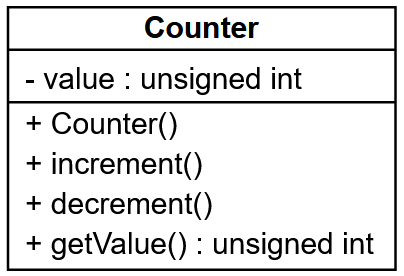

# Premiers pas en POO

## Cours


## Exercice 0

Reprendre le code du cours (classe Point).

??? success "Solution"

    :octicons-file-24: exo0/Point.h

    ```cpp
    #ifndef Point_H
    #define Point_H

    class Point {
        public :
            int x;
            int y;
            char lettre;
            void afficher();
    };

    #endif
    ```

    :octicons-file-24: exo0/Point.cpp

    ```cpp
    #include <iostream>
    #include "Point.h"

    void Point::afficher() {
        std::cout << lettre << "(" << x << "," << y << ")\n";
    }
    ```

    :octicons-file-24: exo0/main.cpp

    ```cpp
    #include "Point.h"

    int main() {
        Point p1, p2;
        p1.x = 5;
        p1.y = 2;
        p1.lettre = 'A';	
        p1.afficher(); 
        p2.x = 3;
        p2.y = -6;
        p2.lettre = 'B';	
        p2.afficher();
        p1.afficher();        
        return 0;
    }
    ```

    Compilation : `g++ exo0/*.cpp -o exo0.exe`

Transformer la classe pour quelle respecte l'encapsulation.

??? success "Solution"

    :octicons-file-24: exo0/Point.h

    ```cpp
    #ifndef Point_H
    #define Point_H

    class Point {
        private :
            int x;
            int y;
            char lettre;
        public :
            void setX(int _x);
            void setY(int _y);
            void setLettre(char _lettre);
            int getX();
            int getY();
            char getLettre();
            void afficher();
    };

    #endif
    ```

    :octicons-file-24: exo0/Point.cpp

    ```cpp
    #include <iostream>
    #include "Point.h"

    void Point::afficher() {
        std::cout << lettre << "(" << x << "," << y << ")\n";
    }

    void Point::setX(int _x) {
        x = _x;
    }

    void Point::setY(int _y) {
        y = _y;
    }

    void Point::setLettre(char _lettre) {
        lettre = _lettre;
    }

    int Point::getX() {
        return x;
    }

    int Point::getY() {
        return y;
    }

    char Point::getLettre() {
        return lettre;
    }
    ```

    :octicons-file-24: exo0/main.cpp

    ```cpp
    #include "Point.h"

    int main() {
        Point p1, p2;
        p1.setX(5);
        p1.setY(2);
        p1.setLettre('A');
        p1.afficher(); 
        p2.setX(3);
        p2.setY(-6);
        p2.setLettre('B');
        p2.afficher();
        p1.afficher();        
        return 0;
    }
    ```

## Exercice 1

Déclarer en C++ la classe correspondant au diagramme suivant :


??? success "Solution"

    ```cpp
    #ifndef IntRange_H
    #define IntRange_H

    class IntRange {
        private :
            int value;
            int min;
            int max;
            void setValue(int _value);
        public :
            void Initialiser();
            void Initialiser(int _min, int _max);
            void Initialiser(int _min, int _max, int _value);
            int getValue();
    };

    #endif
    ```

## Exercice 2

Compléter la classe C++ suivante :

```cpp
______ DataBase {
    _______ :
        string server;
        int port;
        string login;
        ______ password;
        string name;
    public :
        void init(string _server, int _port, string _login, string _password);
        string getIp();
        ______ getPort();
        string getLogin();
        string getName();
        void setName(______ _name);
        string getConnectionString();
        bool connect();
        bool check();
};
```

??? success "Solution"

    ```cpp
    #include <string>       // Pour utiliser la classe string

    using namespace std;    // Pour s'affranchir des std::

    #ifndef DataBase_H
    #define DataBase_H

    class DataBase {
        private :
            string server;
            int port;
            string login;
            string password;
            string name;
        public :
            void init(string _server, int _port, string _login, string _password);
            string getIp();
            int getPort();                  // Accesseur de l'attribut port
            string getLogin();
            string getName();
            void setName(string _name);     // Mutateur de l'attribut name
            string getConnectionString();
            bool connect();
            bool check();
    };

    #endif
    ```

Définir en C++ à l’extérieur de la classe les méthodes `getName()` et `setName()`.

??? success "Solution"

    ```cpp
    string DataBase::getName() {
        return name;
    }

    void DataBase::setName(string _name) {
        name = _name;
    }
    ```

## Exercice 3

Dessiner le diagramme correspondant à la classe C++ suivante dans [Visual Paradigm](https://online.visual-paradigm.com/login.jsp){:target="_blank"} :

```cpp
class Connexion {
    private :
        string ip;
        int port;
    public :
        void initialiser(string _ip, string port);
        string getIp();
        int getPort();
        void connecter();
}
```

??? success "Solution"

    

## Exercice 4

Corriger dans [Visual Paradigm](https://online.visual-paradigm.com/login.jsp){:target="_blank"} la classe suivante pour qu'elle respecte l'encapsulation :


??? success "Solution"

    

## Exercice 5

On souhaite générer une classe représentant un compteur. Celui-ci est composé d'une valeur entière positive ou nulle, nulle à l'origine. Il ne peut varier que par pas de 1 (incrémentation ou décrémentation). Décrémenter un compteur nul est sans effet.

1. Commencer par un diagramme de classe

2. Ecrire la classe Counter dans deux fichiers, un pour la déclaration (Counter.h) et un pour la définition (Counter.cpp)

3. Ecrire un programme de test (exo5.cpp)

??? note "Compiler plusieurs fichiers"

    Créer les fichiers dans un même répertoire, puis les compiler avec la commande : 

    ```
    > g++ *.cpp -o exo_5.exe
    ```

??? success "Solution"

    Diagramme de classe

    
    
    Code :

    :octicons-file-24: exo5/Counter.h

    ```cpp
    #ifndef Counter_H
    #define Counter_H

    class Counter {
        private :
            unsigned int value;
        public :
            Counter();
            void increment();
            void decrement();
            unsigned int getValue();
    };

    #endif
    ```

    :octicons-file-24: exo5/Counter.cpp

    ```cpp
    #include "Counter.h"
    #include <climits>

    Counter::Counter() {
        value = 0;
    }

    void Counter::increment() {
        if (value < UINT_MAX - 1) {
            value++;
        }
    }

    void Counter::decrement() {
        if (value > 0) {
            value--;
        }
    }

    unsigned int Counter::getValue() {
        return value;
    }
    ```

    :octicons-file-24: exo5/main.cpp

    ```cpp
    #include <iostream>
    #include "Counter.h"

    using namespace std;

    int main() {
        Counter c1, c2;

        cout << c1.getValue() << " " << c2.getValue() << endl;

        for (int i = 0; i < 42; i++) {
            c1.increment();
            if (i % 2 == 0) {
                c2.increment();
            }
        }

        cout << c1.getValue() << " " << c2.getValue() << endl;

        for (int i = 0; i < 42; i++) {
            c2.decrement();
            if (i % 2 == 0) {
                c1.decrement();
            }
        }
        
        cout << c1.getValue() << " " << c2.getValue() << endl;

        return 0;
    }
    ```

## Exercice 6

On veut écrire une classe Television comprenant les données membres suivantes :

- status ("On"/"Off")
- volume (0 <-> 50)
    - Le volume ne peut pas aller au-delà des limites.
- channel (1 <-> 100)
    - Les chaînes bouclent.

Le but est d’encapsuler dans une classe des méthodes permettant de manipuler un objet `Television`.

A la création, l’objet `Television` est éteint avec le volume à 0 et sur la chaîne 1.

1. Définir les méthodes que vous devez implémenter dans votre classe (mettez vous en situation d’utilisateur de la classe, les méthodes doivent être pratiques et avoir un nom explicite).

2. Représenter la classe en UML.

3. Ecrire le code de ces méthodes. La déclaration et la définition de la classe (fonctions membres) seront dans des fichiers séparés (Television.h et Television.cpp).

??? success "Correction"

    Diagramme de classe

    

    :octicons-file-24: exo6/Television.h

    ```cpp
    // Television.h
    #ifndef TELEVISION_H
    #define TELEVISION_H

    #include <string>

    using namespace std;

    class Television {
        private :
            bool status;
            int volume;
            int channel;
            void reset();

        public :
            Television();
            void start();
            void stop();
            void channelUp();
            void channelDown();
            void volumeUp();
            void volumeDown();
            string display();
    };

    #endif
    ```

    :octicons-file-24: exo6/Television.cpp

    ```cpp
    // Television.cpp
    #include "Television.h"
    #include <iostream>

    using namespace std;

    Television::Television() {
        reset();
    }

    void Television::start() {
        status = true;
    }

    void Television::stop() {
        reset();
    }

    void Television::reset() {
        status = false;
        channel = 1;
        volume = 0;
    }

    void Television::channelUp() {
        if (status) {
            if (channel < 100) {
                channel++;
            }
            else {
                channel = 1;
            }
        }
    }

    void Television::channelDown() {
        if (status) {
            if (channel > 1) {
                channel--;
            }
            else {
                channel = 100;
            }
        }
    }

    void Television::volumeUp() {
        if (status) {
            if (volume < 50) {
                volume++;
            }
        }
    }

    void Television::volumeDown() {
        if (status) {
            if (volume > 0) {
                volume--;
            }
        }
    }

    std::string Television::display() {
        string display = "[TV] ";
        if (status) {
            display += " status : ";
            display += status ? "on" : "off";
            display += " | volume : " + to_string(volume);
            display += " | channel : " + to_string(channel);
        }
        display += "\n";
        return display;
    }
    ```

    :octicons-file-24: exo6/main.cpp

    ```cpp
    // exo6.cpp
    #include <iostream>
    #include "Television.h"

    using namespace std;

    int main() {

        Television tv;

        cout << tv.display();
        tv.channelUp();
        tv.volumeUp();
        cout << tv.display();
        tv.start();
        tv.channelUp();
        tv.volumeUp();
        tv.volumeUp();
        tv.volumeUp();
        cout << tv.display();
        tv.stop();
        cout << tv.display();
    }
    ```

## Exercice 7

Ecrire une classe Fraction :

- Cette classe contient un numérateur et un dénominateur dont les valeurs par défaut sont égales à 1.

- On pourra instancier un objet Fraction en spécifiant numérateur et dénominateur ou en ne spécifiant que le numérateur.

- On pourra afficher la Fraction sous la forme numérateur/dénominateur.

- On mettra en place les accesseurs nécessaires.

- On pourra additionner deux objets Fraction et obtenir le résultat sous la forme d'un troisième objet Fraction.

Votre mission :

1. Représenter la classe en UML.

2. Ecrire le code de la classe dans des fichiers séparés et un programme de démonstration.

??? danger "Aller plus loin"

    Simplifier la fraction obtenue lors de l'addition.

??? tip "Indice"

    $$
    \frac{a}{b}+\frac{c}{d}=\frac{a*d+c*b }{b*d}
    $$

??? success "Correction"

    Diagramme de classe

    

    En utilisant la fonctionnalité des **valeurs par défaut des paramètres** du C++, on peut passer de la définition de gauche à celle de droite.

    :octicons-file-24: exo7/Fraction.h

    ```cpp
    #ifndef FRACTION_H
    #define FRACTION_H

    class Fraction {
        private :
            int numerateur, denominateur;
            void simplifier();

        public :
            Fraction(int = 1, int = 1); // Utilisation des valeurs par défaut pour les paramètres
            void afficher();
            Fraction additionner(Fraction);
    };

    #endif
    ```

    :octicons-file-24: exo7/Fraction.cpp

    ```cpp
    #include <iostream>
    #include <numeric>
    #include "Fraction.h"

    Fraction::Fraction(int _numerateur, int _denominateur) {
        numerateur = _numerateur;
        denominateur = _denominateur;
    }

    void Fraction::afficher() {
        std::cout << numerateur << "/" << denominateur << std::endl;
    }

    Fraction Fraction::additionner(Fraction _f) {
        Fraction r;

        // Calcul
        r.numerateur = numerateur * _f.denominateur + _f.numerateur * denominateur;
        r.denominateur = denominateur * _f.denominateur;
        
        // Simplification
        r.simplifier();

        return r;
    }

    void Fraction::simplifier() {
        int a, b, temp;
        
        // Solution 1 : Calcul du PGCD avec la fonction standard
        // a = std::gcd(r.numerateur, r.denominateur);

        // Solution 2 : Calcul du PGCD avec l'algo d'Euclide (https://fr.wikipedia.org/wiki/Algorithme_d%27Euclide)
        a = numerateur, b = denominateur;
        while (b != 0) {
            temp = b;
            b = a % b;
            a = temp;
        }

        // Simplification
        numerateur /= a;
        denominateur /= a;
    }
    ```

    :octicons-file-24: exo7/main.cpp

    ```cpp
    #include "Fraction.h"

    int main() {
        Fraction f1, f2(2), f3(1, 3), f4(2, 3);
        
        f1.afficher();
        f2.afficher();
        f3.afficher();
        f4.afficher();
        
        f2.additionner(f3).afficher();                  // 2 + 1/3 = 7/3
        f1.additionner(f2).afficher();                  // 1 + 2 = 3/1
        f2.additionner(f3).additionner(f4).afficher();  // 2 + 1/3 + 2/3 = 27/9 = 3/1

        return 0;
    }
    ```

## Exercice 8

Modifier le fichier Sailor.cpp pour que le programme suivant affiche  :

```
> ./exo8.exe
nom : noname
nom : paul
nom : eric
nom : fred
nom : xavier
nombre de Sailors : 5
```

```cpp
// Sailor.h
#ifndef SAILOR_H
#define SAILOR_H

#include <string>

class Sailor {
    private :
        std::string name;
        static int sailorsCount;
    public :
        Sailor(std::string);
        Sailor();
        ~Sailor();
        int getSailorsCount();
        void setName(std::string);
        void display();
};

#endif
```

```cpp
// Sailor.cpp
#include "Sailor.h"

! A COMPLETER !
```

```cpp
// exo8.cpp
#include <iostream>
#include "Sailor.h"

int main() {
    Sailor sailor1;
    Sailor sailor2("paul");
    Sailor bateau1[3];

    sailor1.display();
    sailor2.display();

    bateau1[0].setName("eric");
    bateau1[1].setName("fred");
    bateau1[2].setName("xavier");

    for (int i = 0; i < 3; i++) {
        bateau1[i].display();
    }

    std::cout << "nombre de sailors : " << sailor1.getSailorsCount();

    return 0;
}
```

??? success "Correction"

    :octicons-file-24: exo8/Sailor.cpp

    ```cpp
    // Sailor.cpp
    #include "Sailor.h"
    #include <iostream>

    int Sailor::sailorsCount = 0;

    Sailor::Sailor(std::string _name) {
        name = _name;
        sailorsCount++;
    }

    Sailor::Sailor() {
        name = "noname";
        sailorsCount++;
    }

    Sailor::~Sailor() {
        sailorsCount--;
    }

    int Sailor::getSailorsCount() {
        return sailorsCount;
    }

    void Sailor::setName(std::string _name) {
        name = _name;
    }

    void Sailor::display() {
        std::cout << "nom : " << name << std::endl;
    }
    ```