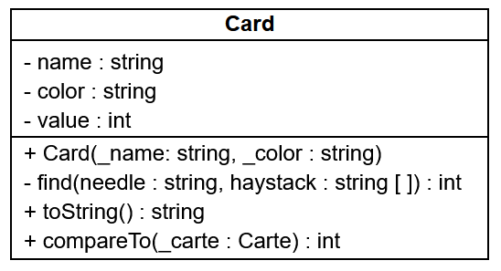

# 03 - POO level 2

## Exercice 1

Sur la base du diagramme de classes ci-dessous, créer le programme qui permet de saisir les noms de plusieurs personnes puis un nombre de groupes à créer. 


Le programme se chargera ensuite de répartir automatiquement les personnes dans les groupes. 

Finalement il affichera la composition des groupes et le groupe d'appartenance de chaque personne.
    
??? tip "Indice"
    
    La classe `std::vector` peut être utile.
    
??? tip "Indice"
    
    On créera d'abord les personnes, puis les groupes dans le `main`.

    Ensuite on attache les personnes aux groupes et les groupes aux personnes.

    On manipulera des **pointeurs** pour les références afin d'éviter les recopies d'objets.

```
> ./exo_1.exe
Saisir les noms des personnes à créer (! pour arrêter) :
#1 : Bianca
#2 : Tryphon
#3 : Archibald
#4 : Allan
#5 : Piotr
#6 : Tchang
#7 : Seraphin
#8 : !
7 personnes saisies.

Nombre de groupes à créer : 3

1
Bianca (1)
Allan (4)
Seraphin (7)

2
Tryphon (2)
Piotr (5)

3
Archibald (3)
Tchang (6)

Bianca (1) appartient au groupe 1
Tryphon (2) appartient au groupe 2
Archibald (3) appartient au groupe 3
Allan (4) appartient au groupe 1
Piotr (5) appartient au groupe 2
Tchang (6) appartient au groupe 3
Seraphin (7) appartient au groupe 1
```

??? success "Correction"

    :octicons-file-24: exo1/person.hpp

    ```cpp
    #include <string>

    #ifndef PERSON_H
    #define PERSON_H

    using namespace std;

    class Group;   // On triche pour éviter une mise en abyme infinie des includes croisés.

    class Person {
        private :
            int id;
            static int count;
            string name;
            Group * group;  // Pour éviter les recopies d'objets, on utilise un pointeur.

        public:
            Person(string);
            void display();
            Group * getGroup();
            void setGroup(Group &); // Le passage par référence simplifie l'utilisation de la méthode.
    };

    #endif
    ```

    :octicons-file-24: exo1/person.cpp

    ```cpp
    #include "person.hpp"
    #include "group.hpp"
    #include <iostream>
    #include <string>

    using namespace std;

    int Person::count = 0;

    Person::Person(string _name) {
        name = _name;
        count++;
        id = count;
    }

    void Person::display() {
        cout << name << " (" << id << ")";
    }

    void Person::setGroup(Group & _group) {
        group = & _group;
    }

    Group * Person::getGroup() {
        return group;
    }
    ```

    :octicons-file-24: exo1/group.hpp

    ```cpp
    #include <vector>

    #ifndef GROUP_H
    #define GROUP_H

    using namespace std;

    class Person;   // On triche pour éviter une mise en abyme infinie des includes croisés.

    class Group {
        private :
            int id;
            vector<Person *> people;  // Pour éviter les recopies d'objets, on utilise des pointeurs.
            static int count;

        public :
            Group();
            int getId();
            void addPerson(Person &); // Le passage par référence simplifie l'utilisation de la méthode.
            void display();
    };

    #endif
    ```

    :octicons-file-24: exo1/group.cpp

    ```cpp
    #include "group.hpp"
    #include "person.hpp"
    #include <iostream>

    using namespace std;

    int Group::count = 0;

    Group::Group() {
        count++;
        id = count;
    }

    int Group::getId() {
        return id;
    }

    void Group::addPerson(Person & p) {
        people.push_back(&p);
    }

    void Group::display() {
        cout << id << endl;
        for (int i = 0; i < people.size(); i++) {
            people[i]->display();   // -> car ce sont des pointeurs qu'on manipule
            cout << endl;
        }
    }
    ```

    :octicons-file-24: exo1/main.cpp

    ```cpp
    #include <iostream>
    #include <vector>
    #include <string>
    #include "person.hpp"
    #include "group.hpp"

    using namespace std;

    int main() {

        vector<Person> allPeople;   // Un tableau pour stocker les personnes créées au fur et à mesure.
        vector<Group> allGroups;    // Un tableau pour stocker les groupes créés.
        
        string input = "";          // Un tampon pour récupérer les noms saisis.
        int nbGroups = 0;
        
        system("chcp 65001");       // Passage de la console Windows en UTF-8
        system("cls");              // Nettoyage de la console

        // Saisie
        cout << "Saisir les noms des personnes à créer (vide pour arrêter) :" << endl;
        do {
            cout << "#" << allPeople.size() + 1 << " : ";
            
            getline(cin, input);    // Permet d'autoriser les saisies vides.

            // Création d'une nouvelle personne
            if (input != "") {
                allPeople.push_back(Person(input));
            }

        } while (input != "");

        cout << endl << allPeople.size() << " personne(s) saisie(s)" << endl << endl;

        // Création des groupes
        do {
            cout << "Nombre de groupes à créer : ";
            cin >> nbGroups;
        } while (nbGroups <= 0);
        for (int i = 0; i < nbGroups; i++) {
            allGroups.push_back(Group());
        }

        // Répartition des personnes dans les groupes
        for (int i = 0; i < allPeople.size(); i++) {
            allGroups[i % nbGroups].addPerson(allPeople[i]);
            allPeople[i].setGroup(allGroups[i % nbGroups]);
        }

        // Affichage des groupes
        cout << endl;
        for (int i = 0; i < allGroups.size(); i++) {
            allGroups[i].display();
            cout << endl;
        }
        cout << endl;

        // Affichage des personnes
        for (int i = 0; i < allPeople.size(); i++) {
            allPeople[i].display();
            cout << " appartient au groupe " << allPeople[i].getGroup()->getId() << endl;
        }

        return 0;
    }
    ```

## Exercice 2


Répondre aux questions suivantes portant sur le diagramme de classes, fruit du travail de conception d’un programme de gestion d’une bibliothèque.

1.	Peut-on créer des utilisateurs sans spécifier de nom&nbsp;? Expliquer.

    ??? success "Correction"

        Deux réponses sont acceptables, car le diagramme de classes manque de précision sur ce point :

            + Non, il n'y a qu'un constructeur déclaré et celui-ci a deux paramètres `string` qui "logiquement" correspondent aux deux attributs nom et email.

            + Oui, le constructeur déclaré a deux paramètres `string`, si l'un deux correspond au nom, alors il est possible de lui passer une chaîne de caractères vide...

2.	Expliquer à quoi correspondent chacun des termes et symboles de la ligne suivante : `isEmailValid(string) : bool`

    ??? success "Correction"

        C'est une méthode et les différents éléments correspondent à :

        + `isEmailValid` : l'identificateur (le nom) de la méthode ;

        + `(string)` : les paramètres de la méthode (les données en entrée), ici une chaîne de caractères ;

        + `: bool` : le type retour de la méthode (les données en sortie), ici un booléen.

3.	Pourquoi la ligne `+ setEmail(string)` de la classe `Utilisateur` n'a pas de partie avec les `:`&nbsp;?

    ??? success "Correction"

        C'est un mutateur, une méthode qui modifie un attribut, elle ne renvoie rien, l'UML nous permet de ne pas écrire `: void`.

4.	Peut-on valider le format d’un email avec la méthode `isEmailValid` en l’appelant sur un objet `Utilisateur` créé dans le programme principal&nbsp;? Expliquer.

    ??? success "Correction"

        Non, la méthode `isEmailValid` est précédée d'un signe `-` qui signifie que la méthode est privée, c'est-à-dire qu'on ne peut l'appeler que depuis la classe et non en-dehors.

5.	Peut-on modifier un emprunt après création&nbsp;? Expliquer.

    ??? success "Correction"

        Par convention de nommage, on peut déduire que les deux méthodes `setDateRetour` et `prolonger` sont des mutateurs, qui permettent de modifier des attributs après sa création.

6.	Doit-on créer un objet `Emprunt` par exemplaire emprunté ou un objet `Emprunt` peut-il concerné plusieurs exemplaires d’un coup&nbsp;? Expliquer.

    ??? success "Correction"

        La cardinalité nous indique qu'un emprunt est relié à un et un seul exemplaire, il faut donc créer un objet `Emprunt` par Exeplaire `emprunté`.

7.	Les attributs `dateEmprunt` et `dateRetourPrevu` de la classe `Emprunt` n’ont pas de mutateur et le constructeur n’a pas de paramètre de type date. Qu’en déduisez-vous sur la valorisation de ces deux dates&nbsp;?

    ??? success "Correction"

        Ils sont probablement généré automatiquement dans le constructeur, la date d'emprunt serait la date du système et la date retour calculée à partir d'une règle comme il est courant d'en rencontrer dans les bibliothèques (emprunt de 4 semaines à Laval Agglo par exemple).

8.	De quel type est l’attribut `emprunts` de la classe `Utilisateur`. Proposer deux manières différentes de l’implémenter en C++. 

    ??? success "Correction"

        ```cpp
        // Si on gère nous-même l'allocation dynamique :
        Emprunt * emprunts;

        // ou mieux :
        vector<Emprunt> emprunts;

        // à la rigueur...
        Emprunt emprunts[];
        ```

9.	L’attribut `- nombre : int` de la classe `Exemplaire` est souligné, qu’est-ce que cela signifie&nbsp;?

    ??? success "Correction"

        L'attribut est static, il est partagé par tous les objets de la classe.

10.	Il n’y a pas de mutateur prévu pour l’attribut `- nombre : int` de la classe `Exemplaire`, comment peut-on incrémenter ou décrémenter cet attribut&nbsp;?

    ??? success "Correction"

        C'est un attribut static, probablement pour compter le nombre d'objets `Exemplaire` dans le système, donc on incrémente probablement ce nombre dans le constructeur et décrémente dans le destructeur.

11.	Comment peut-on, à tout moment, connaître le nombre total de documents disponibles dans la bibliothèque&nbsp;?

    ??? success "Correction"

        Si l'implémentation proposée à la question précédente est bonne, alors à tout moment, l'attribut `nombre` de la classe `Exemplaire`, contient le nombre d'objets dans le système et donc de documents dans la bibliothèque. On peut en récupérer la valeur avec l'instruction : `Exemplaire::getNombre();`.

12.	Pourrait-on mettre en place sur la classe `Emprunt` un attribut `- nombre : int` avec la même caractéristique qu’à la question 9 pour compter le nombre d’emprunts d’un utilisateur&nbsp;? 

    Si oui, que doit-on mettre en place&nbsp;? 
    
    Si non, expliquer pourquoi et indiquer comment réaliser cette demande.

    ??? success "Correction"

        Non, si on mettait cet attribut sur la classe Emprunt, on récupérerai le nombre total d'emprunts (objets `Emprunt`) dans le système. On peut récupérer cette information de deux manières, en fonction de l'implémentation de l'attributs `Uilisateur::empunts` à la question 8 :

        + Si emprunts est un vecteur on pourra récupérer le nombre d'emprunts d'un objet Utilisateur avec l'instruction : `u1.getEmprunts().size()`

        + Si emprunts est un pointeur d'Emprunt (Emprunt *), il faut créer un attribut pour sauvegarder la taille du tableau et un accesseur, on pourra alors récupérer le nombre d'emprunts d'un objet Utilisateur en appelant cet accesseur.

13.	En utilisant les méthodes disponibles, peut-on à partir d’un objet `Livre` remonter jusqu’aux utilisateurs qui en ont emprunté un exemplaire&nbsp;? Expliquer. 

    ??? success "Correction"

        Oui :

        1.  en appelant `getExemplaires` sur un objet `Livre` on récupère un tableau d'exemplaires

        2. en parcurant le tableau d'exemplaires avec une boucle et en appelant `getEmprunt` sur chaque élément

        3. si on ne récupère pas `nullptr`, on peut appeler getUtilisateur() et récupérer l'utilisateur lié à chaque emprunt.

14.	Peut-on avoir des emplacements vides&nbsp;? Pourquoi&nbsp;?

    ??? success "Correction"

        La cardinalité de la liaison entre `Emplacement` et `Livre` nous indique que l'attribut `livres` peut contenir 0 à n livres.

15.	Compléter la déclaration en C++ de la classe Emplacement. 

    On supposera que les directives #include nécessaires ont été réalisées au préalable. 
    
    Ne pas définir les méthodes. 
    
    Les tableaux d’objets `Type` sont déclarés sous la forme d’un objet `vector<Type>`.
    
    ```cpp
    class Emplacement {
        ...
    };
    ```

    ??? success "Correction"

        ```cpp
        class Emplacement {
            private :
                int niveau;
                int etagere;
                int travee;
                vector<Livre *> livres;
            public :
                Emplacement(int, int, int);
                ~Emplacement();
                void addLivre(Livre *);
                void removeLivre(Livre *);
                vector<Livre *> getLivres();
        };
        ```
        

16.	Définir en C++ à l’extérieur de la déclaration de la classe `Livre` les méthodes accesseur et mutateur de l’attribut `titre`.

    ??? success "Correction"

        ```c
        // Accesseur
        string Livre::getTitre() {
            return titre;
        }

        // Mutateur
        void Livre::setTitre(string _titre) {
            titre = _titre;
        }
        ```

## L'exercice en plus

Transformer la fable de la Fontaine suivante en "Le Rossignol et le Kangourou".

```cpp
"Le Corbeau et le Renard\n\n"
"Maître Corbeau, sur un arbre perché,\n"
"Tenait en son bec un fromage.\n"
"Maître Renard, par l'odeur alléché,\n"
"Lui tint à peu près ce langage :\n"
"Et bonjour, Monsieur du Corbeau.\n"
"Que vous êtes joli ! que vous me semblez beau !\n"
"Sans mentir, si votre ramage\n"
"Se rapporte à votre plumage,\n"
"Vous êtes le Phénix des hôtes de ces bois.\n"
"À ces mots, le Corbeau ne se sent pas de joie ;\n"
"Et pour montrer sa belle voix,\n"
"Il ouvre un large bec, laisse tomber sa proie.\n"
"Le Renard s'en saisit, et dit : Mon bon Monsieur,\n"
"Apprenez que tout flatteur\n"
"Vit aux dépens de celui qui l'écoute.\n"
"Cette leçon vaut bien un fromage, sans doute.\n"
"Le Corbeau honteux et confus\n"
"Jura, mais un peu tard, qu'on ne l'y prendrait plus.\n\n";
```

!!! note "Toutes les mentions de la classe `string` dans cette exercice  désigne la classe `std::string`."

1.  Initialiser un objet `string` avec la chaîne de caractères ci-dessus.

2.  Créer la fonction suivante:

    ```cpp    
    /**
    * @brief Remplace dans str toutes les occurences de search par replace.
    * 
    * @param str La chaîne d'origine
    * @param search La chaîne recherchée
    * @param replace La chaîne de remplacement
    */
    void replaceAll(string & str, string search, string replace);
    ```

    en utilisant seulement les méthodes suivantes de la classe `string` :

    ```cpp
    /**
    * @brief Renvoie la longueur en octets de la chaîne.
    * 
    * @return int La longueur en octets de la chaîne.
    */
    int string::length();

    /**
    * @brief Renvoie la position dans la chaîne de la première occurence de str à partir de pos.
    * 
    * @param str La chaîne recherchée
    * @param pos (facultatif) La position à partir de laquelle str est recherchée
    * @return int La position du premier caractère de la première occurence de str dans la chaîne. Si aucune occurence n'est trouvée, renvoie string::npos.
    */
    int string::find(string str, int pos);

    /**
    * @brief Remplace len caractères à partir de la position pos par la chaîne s.
    * 
    * @param pos La position à partir de laquelle le rmeplacement commence.
    * @param len Le nombre de caractères à remplacer.
    * @param s La châine à insérer à la place des caractères à remplacer.
    * @return string* Un pointeur vers la chaîne.
    */
    string * string::replace(int pos, int len, string s);
    ```

3. Utiliser la fonction `replaceAll()` pour remplacer toutes les occurences de `Corbeau` et `Renard` respectivement par `Rossignol` et `Kangourou`.

4. Créer une fonction qui calcule et renvoie la longueur du plus long vers en utilisant seulement les méthodes ci-dessus.

5. Insérer votre signature en bas à droite de la fable alignée sur le vers le plus long en utilisant seulement la fonction que vous avez créée et les surdéfinitions suivantes de la méthode `string::append()` :

    ```cpp
    /**
    * @brief Allonge la chaîne en ajoutant n fois le caractère c à la fin de celle-ci. 
    * 
    * @param n Le nombre d'occurences de c attendues
    * @param c Le caractère à ajouter.
    * @return string* Un pointeur vers la chaîne.
    */
    string * string::append(int n, char c);

    /**
    * @brief Allonge la chaîne en ajoutant s à la fin de celle-ci.
    * 
    * @param s La chaine à ajouter.
    * @return string* Un pointeur vers la chaîne.
    */
    string * string::append(string s);
    ```

6. Tester votre code sur une autre fable.

Résultat final :

{ align=right }

```
> ./fable.exe
Maître Rossignol, sur un arbre perché,
Tenait en son bec un fromage.
Maître Kangourou, par l'odeur alléché,
Lui tint à peu près ce langage :
Et bonjour, Monsieur du Rossignol.
Que vous êtes joli ! que vous me semblez beau !
Sans mentir, si votre ramage
Se rapporte à votre plumage,
Vous êtes le Phénix des hôtes de ces bois.
À ces mots, le Rossignol ne se sent pas de joie ;
Et pour montrer sa belle voix,
Il ouvre un large bec, laisse tomber sa proie.
Le Kangourou s'en saisit, et dit : Mon bon Monsieur,
Apprenez que tout flatteur
Vit aux dépens de celui qui l'écoute.
Cette leçon vaut bien un fromage, sans doute.
Le Rossignol honteux et confus
Jura, mais un peu tard, qu'on ne l'y prendrait plus.

                                       Mathieu DOMER
```

## L'exercice en plus en plus

On souhaite coder un programme permettant de simuler une partie de bataille.

Pour cela, il faut créer un jeu de cartes, le mélanger, les distribuer à deux joueurs et pouvoir les comparer.

On décide de créer la classe `Card` dont le diagramme de classe est la suivant :



Description de la classe :

+   L'attribut `name` contiendra le nom de la carte qui doit figurer dans la liste suivante : `"2", "3", "4", "5", "6", "7", "8", "9", "10", "J", "Q", "K", "A"`;

+   L'attribut `valeur`, qui permet de comparer les cartes, correspond à l'indice du `name` dans la liste précédente (ex : un 7 à une valeur de 5);

+   L'attribut `couleur` contiendra la couleur de la carte qui doit figurer dans la liste suivante : `"♥", "♠", "♦", "♣"`;

+   Le constructeur s'assure que les valeurs de nom et de couleur fournis respectent les règles ci-dessus et déduit la valeur de la carte. En cas d'erreur concernant le nom ou la couleur, une exception invalid_argument doit être levée;

+   La méthode `find()` doit renvoyer l'indice du premier paramètre dans le second ou -1 s'il n'y est pas présent;

+   La méthode `toString()` renvoie une chaîne de caractère au format `[{color} {name}]` (ex : `[♠ Q]` pour la dame de pique);

+   La méthode `compareTo()` à la manière de `strcmp()` renvoie :

    +   0 si les deux cartes ont la même valeur,

    +   -1 si la carte est de valeur inférieure à celle passée en paramètre,

    +   1 si la carte est de valeur supérieure à celle passée en paramètre.

Les listes de couleurs et de noms doivent être déclarées en tant qu'attribut **statique**, **constant** et **public** de la classe `Card`.

1.  Développer la classe Card et la tester en instanciant une dame de pique et un as de cœur, en les comparant et en les affichant.

3.  Coder le programme principal permettant de simuler la partie de bataille :

    1.  Création des 52 cartes

    2.  Mélange du paquet

        On pourra utiliser le code suivant :

        ```cpp
        #include <algorithm>
        #include <random>
        
        ...
        vector<Card> deck;

        // Initialisation de la génération pseudo-aléatoire
        default_random_engine dre(time(NULL));
        // Mélange du vecteur deck
        shuffle(deck.begin(), deck.end(), dre);
        ```

    3.  Distribution des cartes en utilisant la classe `deque` qui permet de gérer une pile ou une file.

    4.  Partie de bataille.

        ⚠️ Il faut un tas de carte pour le joueur 1, pour le joueur 2 et la table.

        ⚠️ Il faut être rigoureux avec les entrées/sorties des cartes dans les tas ! 

        ⚠️ En fonction de l'implémentation, certains mélanges créent des parties infinies ! Il faut trouver une parade en ajoutant un soupçon d'aléa !

??? success "Solution"

    