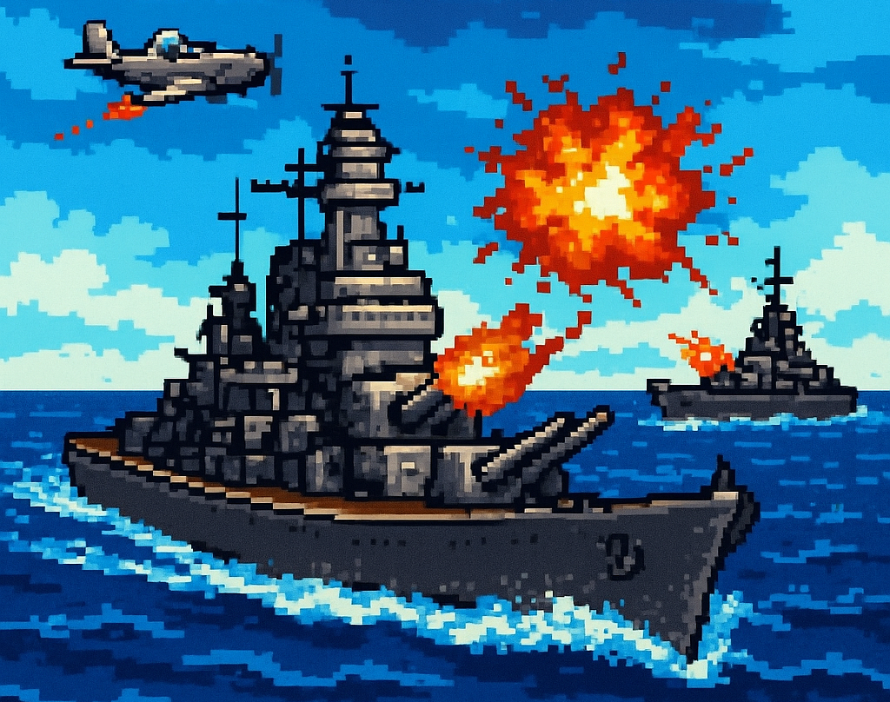
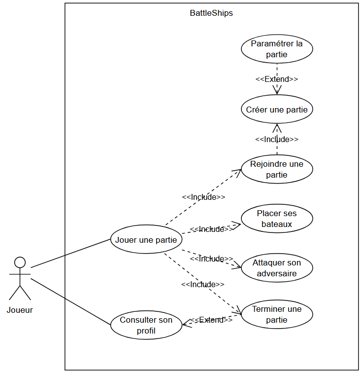

# BattleShips

## Brainstorming initial

### Architecture

+   Machine hôte-cliente
+   Numéro de port
+   Réponse aux actions des joueurs
+   Possibilité d'arrêter et reprendre une partie
+   PC A -> n° de case (A7) -> PC B
+   PC B -> état de la case (00 pas touché, 10 touché, 11 coulé) -> PC A

### IHM

+   Affichage des 2 plateaux
+   Liste des bateaux à éliminer et restant en jeu
+   Les bateaux sont déplaçables tant qu'on n'a pas validé son plateau de jeu
+   Placer un bateau permet de l'orienter
+   Le placement se termine par une validation

### Mécanismes de jeu

+   Choix aléatoire du premier joueur

## Cas d'utilisation / Scénarios

+   Créer une partie

    +   Générer et communiquer un code

    +   Paramétrer la partie

        +   Taille du plateau

        +   Le nombre et la taille des bateaux

        +   Temps de jeu ?

        +   Rejouer si touche ?

        +   Attaque simultanée ?

    +   Attendre l'autre joueur

+   Rejoindre une partie

    +   Renseigner un code

    +   Rejoindre une partie aléatoire ?

    +   Attendre l'autre joueur

+   Reprendre une partie

    +   Renseigner un code

    +   Attendre l'autre joueur

+   Placer ses bateaux

    +   Orienter les bateaux

    +   Valider le placement

    +   Optionnel ? minuteur (ex : 1'30")

    +   Optionnel ? placement auto si délai dépassé

+   Attaquer son adversaire

    +   Pré-requis : les deux joueurs ont terminé la phase de placement

    +   Si première attaque : tirage au sort

    +   Choisir une case

        +   Vérifier si attaquable

    +   Valider la case

    +   Visualiser l'attaque (animation)

    +   Optionnel : ré-attaquer si touche

    +   Optionnel ? minuteur (ex : 30" pour attaquer, paramétrable)

+   Terminer une partie

    +   Gagner ou perdre

    +   Calculer un score

+   Consulter son profil

    +   Choisir un nom de joueur

    +   Consulter son historique

    +   Calculer un rang

    +   Photo de profil

    +   Trophées/succès ?

        +   Titres/Surnoms utilisables

### Diagrammes des cas d'utilisation

### Scénarios

!!! info

    Chaque cas d'utilisation est détaillé sous la forme de scénarios, on y distingue :

    -   Le numéro et le titre du cas d'utilisation
    
    -   Les **pré-requis** à l'exécution du cas d'utilisation

        *Exemple : L'utilisateur est connecté*

    -   Les **acteurs** impliqués

    -   Le **déroulement** des scénarios : la suite d'action à réaliser pour exécuter le scénario

        *Exemple :*

        1.  *L'utilisateur lance le logiciel*,

        2.  *L'utilisateur clique sur* "Nouveau document",

        3.  *L'utilisateur saisit le texte désiré.*

        On distingue les scénarios **alternatifs** et les **cas d'erreur**.

