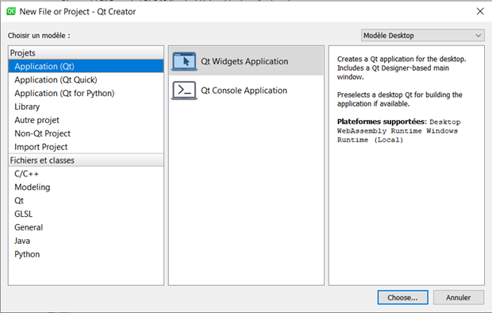
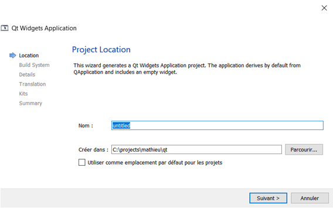
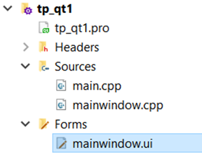
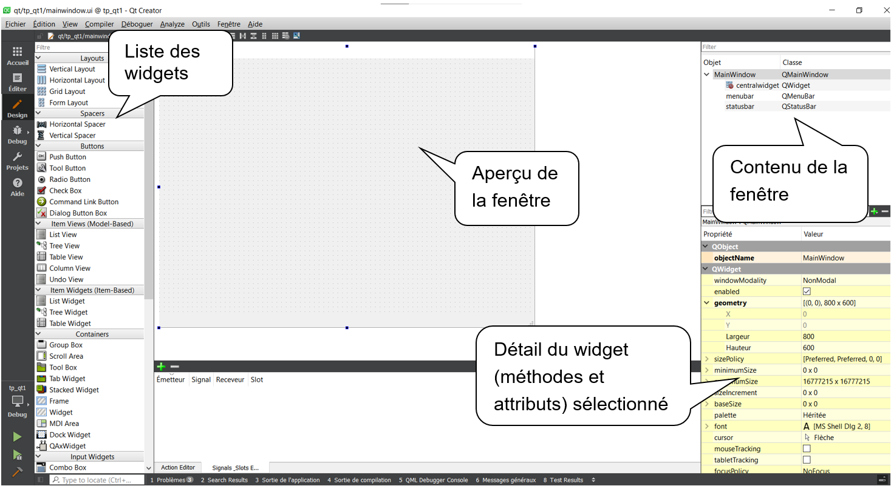
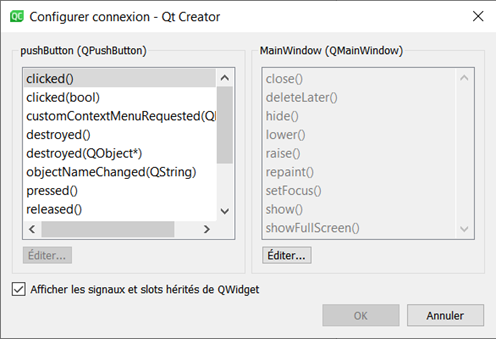

# Qt - Premier projet

## Création d’un projet

1. Cliquer sur : **Fichier > Nouveau fichier ou projet**
    
    
    
2. Sélectionner **Application (Qt)** puis **Qt Widgets Application** et cliquer sur **Choisir…**
    
    
    
3. Sur la page suivante donner un nom au projet et sélectionner le chemin du projet (au choix) les répertoires sont à créer s’ils n'existent pas.
    
    
    
4. Valider les étapes suivantes. Le projet est créé.
5. Appuyer sur la flèche verte en bas à gauche.
    
    
    
6. Le programme se lance, la fenêtre est vide.
    
    
    
7. Dans la partie projet double cliquer sur le fichier mainwindow.ui.
    
    
    
8. Le designer apparaît :
    
    
    
9. Utiliser la touche « F1 » pour avoir de l’aide sur les classes des widgets et des classes Qt.
La documentation est disponible sur https://doc.qt.io/

## Fichier mainwindow.cpp

```cpp
#include "mainwindow.h"
#include "ui_mainwindow.h"

MainWindow::MainWindow(QWidget *parent)
    : QMainWindow(parent)
    , ui(new Ui::MainWindow)
{
    ui->setupUi(this);
}

MainWindow::~MainWindow()
{
    delete ui;
}
```

`this` est un pointeur sur l'objet MainWindow

`ui` est un pointeur sur les widgets ajoutés de la fenêtre :


## Signaux et slots

1. Pour ajouter un bouton sur la fenêtre faire un glisser-déposer du widget vers la fenêtre
    
    
    
2. Pour associer un slot sur le click du bouton, passer en mode slots (F4), cliquer sur le bouton et déplacer le curseur dans une zone de la fenêtre.
La liste des signaux et slots s'affiche.
    
    
    
3. Choisir le signal et le slot associé, ici, on choisit pushButton, clicked() -> MainWindow, close().
    
    
    
4. Valider et visualiser le résultat graphique.
    
    
    
5. Résultat : un clic sur le bouton ferme la fenêtre.
Lancer et tester l’application en appuyant sur la flèche verte en bas à gauche.
    
    
    
6. On peut aussi associer un signal à un slot en faisant un clic droit sur le widget et choisir "Aller aux slots".
    
    
    
7. Cela va générer un squelette de fonction pour le slot dans la classe MainWindow.
    
    
    
8. Pour mettre des traces dans votre programme vous pouvez utiliser qDebug().
qDebug s’utilise comme cout.
Les messages soumis à qDebug() s'affichent sur l'onglet "Sortie de l'application".
    
```cpp
#include <QDebug>
...
qDebug() << " je suis passé par ici";
```
