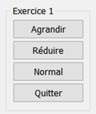
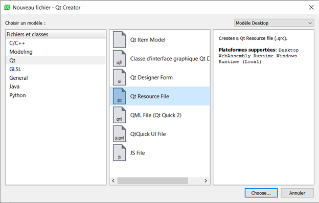
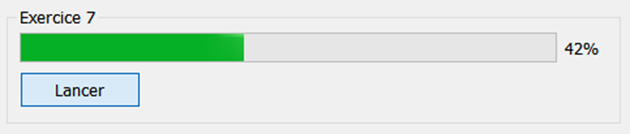
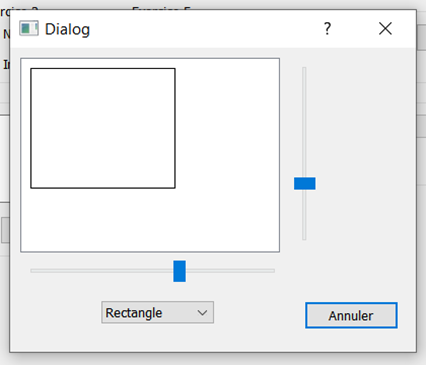

# Exercices

Au travers des exercices suivants, vous allez pouvoir manipuler les widgets et le mécanisme de signal/slot sur la base du cours, des éléments vus précédemment et de vos recherches dans la documentation.


Créer une application graphique QT Widgets dont le titre est **TP QT BTS2** et qui servira de projet pour l’**ensemble des exercices**.
    
## Exercice 1

!!! abstract "Objectifs"

    +   Créer des boutons
    
    +   Leur affecter des actions avec le designer et avec le code.

1. Ajouter 4 boutons à l’aide du designer :
    
    
    
2. Utiliser l'association des signaux et slots ( ++f4++ ) pour réaliser ces 3 actions :

    - Bouton **Agrandir** affiche la fenêtre en taille maximale.

    - Bouton **Normal** affiche la fenêtre dans sa taille d'origine

    - Bouton **Quitter** ferme l'application

3. Utiliser la **connexion par le code** pour réaliser l'action suivante :

    - Bouton **Réduire** réduit la fenêtre dans la barre des tâches (MainWindow).

## Exercice 2

!!! abstract "Objectifs"

    +   Modifier un widget créé via le designer par le code

    +   Faire communiquer deux widgets en utilisant le designer.

1. Ajouter un widget ComboBox et un widget LineEdit via le designer :
    
    
    
2. Remplir la ComboBox avec la méthode `addItem()` de la classe `QComboBox` depuis le constructeur de la `MainWindow` (en utilisant `ui`).

3. Utiliser l'association des signaux et slots (F4) pour remplacer le texte du LineEdit par le texte de l’item sélectionné dans la ComboBox.

## Création de signals et de slots


## Exercice 3

!!! abstract "Objectifs"

    Créer un slot et le connecter à des widgets.

1. Ajouter un GroupBox et y ajouter deux RadioButton.
    
    
    
    Suivant la sélection, une image sera affichée ou non au fond de la fenêtre.
    
2. Ajouter un slot `changeBackground()` dans la classe `MainWindow` pour traiter la sélection des `QRadioButton`. La définition de la méthode sera traitée plus loin dans l’exercice.

3. Par programmation, dans le constructeur de la `MainWindow`, connecter (avec la primitive `connect`) le signal `clicked()` des deux `QRadioButton` au slot `changeBackground()`.

4. Ajouter une image en tant que ressource du projet :

    1. Dans l’arborescence, cliquer-droit sur le nom du projet et choisir **Add new…**

    2. Dans la fenêtre, choisir **Qt > Qt Resource File** et cliquer sur **Choose…**
        
        
        
    3. Nommer le fichier **resources.qrc** et valider les étapes suivantes

    4. Double-cliquer sur le nouveau fichier

    5. Cliquer sur **Add Prefix**

    6. Modifier la valeur du **Préfixe** pour **/images**

    7. Copier-coller une image (800x600) au choix dans le dossier du projet via l’explorateur Windows

    8. Cliquer sur **Add Files**

    9. Sélectionner l’image et valider
        
        
        
    10. Sauvegarder le fichier **resources.qrc**

5. En fonction du `QRadioButton` coché (`checked`), utiliser la méthode `setStyleSheet()` de la classe `MainWindow` pour changer l’image de fond du widget central avec une des valeurs suivantes :
    
    ```cpp
    // Utiliser une image pour le fond d'écran
    "#centralwidget { background-image: url(:/images/nom_de_l_image.jpg); }"
    
    // Masquer l'image en fond d'écran
    "#centralwidget { background-image: none; }"
    ```
    
## Exercice 4

!!! abstract "Objectifs"

    Récupérer une valeur de l’IHM depuis un slot créé.

On veut pouvoir modifier le titre de la fenêtre après avoir saisi une valeur dans un widget LineEdit et appuyé sur Entrée.

Peut-on le faire directement depuis le designer ? Pourquoi ?

1. Ajouter un widget **LineEdit**.
    
    
    
2. Créer un slot `changeWindowTitle()` dans la classe `MainWindow`.

3. Récupérer la valeur du widget `QLineEdit` et la passer à la méthode `setWindowTitle()` de la classe `MainWindow`.

4. Avec le designer, réaliser la connexion nécessaire pour répondre au besoin. 

Si le slot créé n’apparaît pas dans la liste, il faut l’ajouter en utilisant le bouton **Editer…** de la fenêtre **Configurer connexion**.
    


## Repartir du bon pied

Projet avec les 4 premiers exercices : 📂[TP_QT_BTS2 0.4](../files/bts2/TP_QT_BTS2.zip)

## Exercice 5

!!! abstract "Objectifs"

    +   Passer des valeurs d’un widget à un autre
    +   Créer et émettre un signal

On souhaite réaliser une calculatrice "simple" :


+ Elle est composée de deux **sliders** qui pilotent l’affichage de deux **LCDNumber**.

+ Le **+** central est affiché à l’aide d’un label.

+ L’affichage sombre des **LCDNumber** est réalisé en passant la propriété **segmentStyle** à **Flat**.

**Réaliser cette première partie** de l’exercice avec le designer.


Au clic sur le bouton **=**, la somme des deux valeurs de **sliders** doit s’afficher dans un troisième **LCDNumber**. Toutefois, le signal clicked() de la classe QPushButton n’a pas de paramètre de type entier et  permet encore moins d’envoyer deux valeurs qui ne lui appartiennent pas.


Le clic sur le `QPushButton` va devoir déclencher un slot (à créer) dans la classe `MainWindow` qui va lui-même émettre un signal au bon format (à créer) qui sera connecter au slot `display(int)` du troisième `QLCDNumber`.

**Réaliser cette seconde partie** pour terminer la « calculatrice ».

## Exercice 6

!!! abstract "Objectifs"

    +   Utiliser les slots de manipulation de texte.
    +   Personnaliser un widget avec une image

1. Ajouter sur la fenêtre un widget Textedit et deux boutons Copier et Coller pour copier ou coller du texte dans notre boite de texte.
    
    Les icones sont modifiables dans la fenêtre des propriétés via l’attribut « Marche normale » de l’attribut icon des `QAbstractButton`. On peut trouver de nombreuses icones libres de droits sur Internet, par exemple sur le site [iconmonstr.com](https://iconmonstr.com/).
    
2. Ajouter une icône aux deux boutons en important au préalable deux icones dans le fichier resources.qrc.
    
    
    
3. Utiliser l'association des signaux et slots ( ++f4++ ) pour finir l’exercice.

## Exercice 7

!!! abstract "Objectifs"

    Comprendre le fonctionnement des progressBar.

1. Ajouter un widget Progress bar et un bouton Lancer.
    
    
    
    Il va falloir dans le slot du bouton faire une boucle allant de 0 à 100 et qui sera temporisée à chaque tour pendant 100ms. Pour temporiser le programme, on utilisera la méthode `msleep(int)` de la classe `QThread` qui suspend le thread.
    
2. Lancer la progression de la barre en prenant comme unité le centième de seconde.

??? danger "Aller plus loin"

    Temporiser avec `QThread::msleep()` met en sommeil le thread de l'application et bloque l'utilisation de l'IHM 😥

    Etudier l'utilisation de la classe `QTimer` et l'implémenter pour ne pas paralyser l'application.

## Exercice 8

!!! abstract "Objectifs"

    Ajouter une action dans le menu.

1. Ajouter un menu sur la fenêtre. Ce menu pour l'instant n'a que l'option **Quitter** qui fermera notre application.
    
    
    
2. Connecter le signal `triggered()` sur l'action **Quitter** du menu au slot `close()` de l'application.

## Exercice 9

!!! abstract "Objectifs"

    +   Surdéfinir une fonction d’une classe ascendante

    +   Implémenter une classe du framework en s’aidant de la documentation

L’application peut à présent être fermée depuis le menu, depuis la croix en haut à droite et depuis le bouton créer dans l’exercice 1. On souhaite prévenir toute fermeture accidentelle par l’ajout d’une confirmation avant fermeture. L’implémenter dans chacun des trois mécanismes mis en place ne serait pas très pertinent.

Qt a prévu ce genre de besoin en créant une méthode `closeEvent()` dans la classe `QWidget`. Cette dernière centralise les appels à la fermeture de fenêtre. Pour ajouter le comportement attendu, il faut surdéfinir cette fonction dans notre `MainWindow`.

1. Surdéfinir la méthode `QWidget::closeEvent()` dans la `MainWindow`.
    
    Le paramètre `event` de la méthode permet d’agir sur la fermeture en l’acceptant ou l’ignorant à l’aide des méthodes `accept()` et `ignore()`. De base, l’implémentation de `QWidget::closeEvent()` accepte toujours l’événement.
    
    Pour savoir si on accepte ou non la fermeture de la fenêtre, on va utiliser une `QMessageBox` dont la documentation officielle donne des exemples d’implémentation très complet.
    
    
    
2. Réaliser la fonctionnalité à l’aide des éléments ci-dessous et de la documentation de Qt.

## Exercice 10

!!! abstract "Objectifs"

    +   Ajouter une fenêtre à l’application

    +   Manipuler des éléments graphiques

Dans ce dernier exercice, on souhaite ajouter un nouveau menu qui permettra d’ouvrir une fenêtre dans laquelle on pourra manipuler une forme graphique (rectangle ou cercle).



1.  Ajouter au projet une nouvelle classe d’interface graphique Qt Designer (Dialog)
    
    

2.  En fonction de la version de Qt, le générateur peut proposer de choisir un type de fenêtre : choisir une fenêtre sans bouton et valider les étapes suivantes.

3.  Ajouter un bouton « Annuler » sur la nouvelle fenêtre et faire en sorte qu’il ferme la fenêtre quand on clique dessus.
    
    Deux slots permettent de fermer une fenêtre de type `QDialog` : `accept()` et `reject()`.
    
4.  Ajouter une action **Figures** dans le menu **Menu** de la `MainWindow`.

5.  Créer un slot `showDialog()` dans la `MainWindow` et le déclencher quand on clique sur le menu **Figures**.

6.  Pour ouvrir la nouvelle fenêtre, il faut créer un objet de la classe de Dialog et lancer sa méthode exec(). 

    Ouvrir la nouvelle fenêtre au clic sur le menu **Figures**.

7.  On souhaite afficher un rectangle dans un widget `QGraphicsView` et piloter sa largeur et sa hauteur via deux **sliders** disposés respectivement en dessous et sur la droite de ce widget.
    
    Ajouter les trois widgets avec le designer.
    
8.  Pour afficher le rectangle, il faut ajouter un objet `QGraphicsScene` dans le widget **GraphicsView** et y dessiner un rectangle avec la méthode `addRect()`.
    
    Exemple de code :
    
    ```cpp
    // Création de la scène
    
    QGraphicsScene * scene = new QGraphicsScene(ui->graphicsView);
    
    scene.setSceneRect(0, 0, 256, 192);
    
    ui->graphicsView->setScene(scene);
    
    // Création du rectangle
    
    QGraphicsRectItem * rectangle = scene->addRect(10, 10, 80, 50);
    ```
    
    Afficher un rectangle dans le widget **GraphicsView**.
    
9.  Pour modifier les dimensions du rectangle, il faut redéfinir ses dimensions à l’aide de la méthode `setRect()`.

    Piloter les dimensions du **rectangle** avec les **sliders**.

10. Ajouter un widget **ComboBox** qui permet de permuter l’affichage entre un **rectangle** et une **ellipse**.
