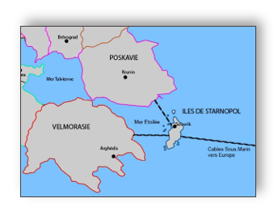

# Passe ton Hack d'abord

## Scénario 2026 :  Le conflit des mers étoilées

### Contexte géopolitique

La Velmorasie, une puissance économique et technologique émergente, domine la région grâce à ses infrastructures numériques avancées et ses data centers qui contrôlent une grande partie des flux d’informations dans la mer Étoilée. La Poskavie, un état autoritaire aux ambitions expansionnistes, cherche à contester cette suprématie en s’appuyant sur des capacités cyberoffensives sophistiquées, développées par des unités étatiques et des groupes de hackers affiliés. Les Îles de Starnopole, un archipel stratégique mais technologiquement moins avancé, dépendent fortement des infrastructures numériques de la Velmorasie pour leur économie et leur sécurité, mais elles maintiennent une neutralité précaire dans le conflit.

Des tensions historiques autour des droits d’exploitation des ressources maritimes et des câbles sous-marins reliant les trois territoires ont dégénérés en une série d’incidents cybernétiques. La Poskavie accuse la Velmorasie de monopoliser les flux des données pour espionner ses activités économiques, tandis que les Iles de Starnopole craignent d’être prisent en otage dans un conflit numérique qui pourrait paralyser leurs systèmes critiques.

## Règlement

## Entraînement

Voici quelques sites qui vous permettront de vous entraîner aux épreuves du concours Passe ton Hack d'abord :

+   Le projet OSINT (challenge web) : [https://the-osint-project.fr/](https://the-osint-project.fr/)

+   Les archives du concours Prologin (challenge programmation) : [https://prologin.org/train/](https://prologin.org/train/)

+   Le site root.me (challenge hacking) : [https://www.root-me.org/

+   Les archives du concours Hackropole (challenges divers) : [https://hackropole.fr/fr/challenges/](https://hackropole.fr/fr/challenges/)